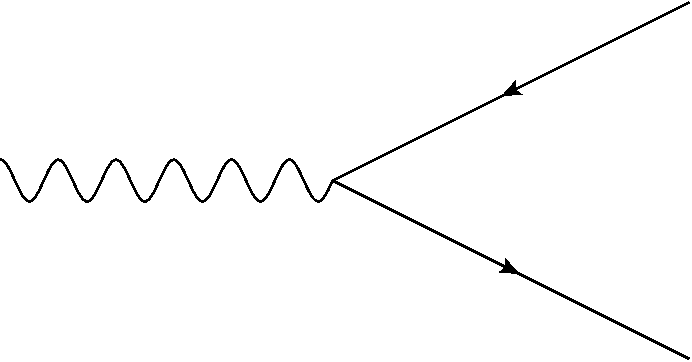
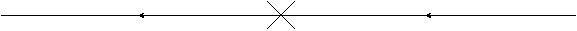
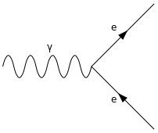
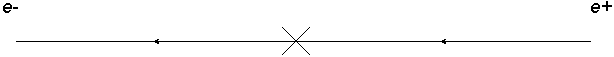
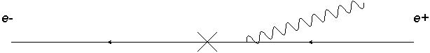
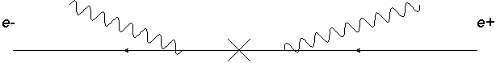
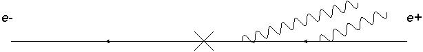
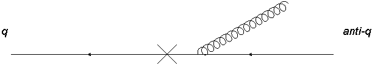
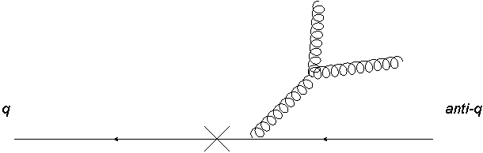

Particle colliders investigate the fundamental structure of matter using collisions of particles at high energies. These collisions produce jets of particles that spray out into the detector, and the structure of these jets is determined by the interactions of the particles involved. The physics of jets and their production is of particular importance in hadron colliders like the Large Hadron Collider (LHC) at CERN, where protons are collided at very high energies.

This post will cover an advanced treatment of the field theory for understanding these collisions, where we calculate the cross-section for the collision and its angular profile. Because the LHC collides protons, which are made of quarks and gluons, the strong force mediates the interaction; we must therefore use quantum chromodynamics (QCD) to describe the interactions.

This post is a write-up of some notes of quantum chromodynamics I made some time ago, but will put up now. The core Phenomenology. Phenomenology is the study of the interactions of particles and their decays, with a focus on drawing out measurable and experimentally-relevant results. In this case we will be looking at the decay of a photon into a quark-antiquark pair and the subsequent emission of gluons from the quarks. In the end we will find the matrix elements for these processes and to study the angular ordering that results from the collinear limit. It will be very mathematical; the aim is to show some calculations as is. These derive from quantum field theory, gauge theories and the standard model of particle physics. The results are useful for understanding the structure of jets in hadron colliders like the LHC and phenomena like the running of the strong coupling constant.

For a clear introduction to quantum field theory and the QCD requirred for this post, I recommend the following books. The standard reference for quantum field theory is @peskin2018introduction, but I also recommend @thomson2013modern as an accessible source for particle physics in general. For QCD in particular, the lecture notes by @mangano1999introduction and @skands2013introduction are excellent resources. For extra information about the running of the strong coupling constant and quark confinement, consider these notes by @Deur_2016.

# Introduction

The aim is post is to study the soft emissions of photons and gluons from a hard photon decay to a particle/antiparticle pair. I will derive the matrix elements (the central force-dependent component of the scattering cross-section) for such processes with a focus on the correlated emission of gluons and the application of the collinear limit. From this I will also extract the resulting angular ordering and compare gluon emissions to photon emissions. Finally we will look at the running of the strong coupling constant apparent in the results.

In the decay of a Z boson or a photon into a quark/antiquark pair, it is possible for gluons to be emitted from the quarks, a process that contributes to hadronization and jet structure. In the limit where these gluons are soft (low energy) and collinear (emitted at a very small angle relative to another particle) the matrix elements for these interactions simplify in an interesting way. First I will consider the decay of a photon into an electron-positron pair when we look at the simpler case of photon emissions. Then we shall look at the decay into a quark-antiquark pair from which gluon emissions can be studied. The decays will be of the form in @fig-decay but for brevity we shall re-write the diagram in the 'decay product form' illustrated in @fig-productform.

{#fig-decay}

{#fig-productform}

## Assumptions

We start with certain assumptions that greatly simplify the calculations and enable us to produce much simpler expressions for the matrix elements.These are:

1. Softness of the emitted gluons with respect to the quarks. This means that for gluon 4-momentum k and quark/antiquark 4-momenta $P_1, P_2$; $k<<P_1,P_2$ and we can neglect any terms quadratic in k.
2. Massless quarks. The momenta involved in the interaction are such that the masses are negligible and can be neglected. This assumption also allows us to simplify our calculations further by using the Dirac equations $\bar{u}(p_1)\not{p_1}=0, \not{p_2}v(p_2)=0$
3. Collinearity. The gluon momenta are at small angles from the quark momenta and the decay products are at small angles to each other.

Note the use 'dashed' notation for 4-momenta, e.g. $p_1$ is the 4-momentum of the first fermion in the decay and $\not{p_1}=\gamma^\mu p_{1\mu}$ is the Dirac operator acting on that momentum. The Dirac spinors $u(p)$ and $v(p)$ are used to represent fermions and antifermions respectively.

# Comparison with QED

In a photon decay to lepton/antilepton pair we can see radiative corrections with photons being emitted from the leptons. This situation will be very similar to our gluon diagrams with some important differences. Since QCD is a non-abelian gauge theory the gluons have colour charge and can couple to other gluons; photons being chargeless cannot couple to other photons and so all photon emissons are *independent* whereas we can have *correlated* gluon emissions (where we have triple or higher gluon verticies in our diagram).

{#fig-ptoe}

{#fig-electronnophoton}

The $ \gamma \rightarrow q \bar{q}$ decay with no photon emission shown in @fig-ptoe is:

$$
M_{e^+e^-}=\epsilon_\mu (q) \bar{u}(p_1)ie\gamma^\mu v(p_2)
$${#eq-electronnophoton}

Where the momenta satisfy $q=p_1+p_2$. Henceforth the parent particle will have momentum $q$, the daughter fermions $p_1,p_2$ and any bosons will have $k_i$. This matrix element is made up of the polarization vector $\epsilon_\mu (q)$ of the parent particle, the Dirac spinors $\bar{u}(p_1),v(p_2)$ of the daughter fermions and the vertex factor $ie\gamma^\mu$ where $e$ is the electric charge. The matrix element is Lorentz invariant and can is used to calculate the cross-section for this decay.

## One Photon Emission
With one soft photon emission $\gamma \rightarrow q \bar{q}+\gamma$ we have two diagrams. From assumption (2) we have neglected the masses in the propagators. The diagrams for this decay follow the form in @fig-electrononephoton

{#fig-electrononephoton}

$$
M_{e^+e^-\gamma}=\epsilon_\mu (q)\bar{u}(p_1)ie\gamma^\mu\left[ -i\frac{\not{p_2}+\not{k}}{(p_2+k)^2}\epsilon_\nu (k) ie\gamma^\nu + \epsilon_\nu (k) ie\gamma^\nu i\frac{\not{p_1}+\not{k}}{(p_1+k)^2}\right]v(p_2)
$$

This expression is equivalent to the element in @eq-electronnophoton, but with an additional expression (in square brackets) that represents the contrubtion from the photon emission. When we apply assumption (1) such that $(p_2+k)^2=p_2^2+k^2+2p_2.k=2p_2.k$ and the general expression $\not{p}\not{k}+\not{k}\not{p}=2p.k$ and remembering that $\epsilon_\mu \gamma^\mu=\not{\epsilon}$ and finally using the Dirac equations specified in assumption (2) we can then find:

$$
M_{e^+e^-\gamma}=\epsilon_\mu (q)\bar{u}(p_1)ie^2 \gamma^\mu v(p_2)\left[\frac{p_1.\epsilon}{p_1.k}- \frac{p_2.\epsilon}{p_2.k}\right]
$$

and when we compare with @eq-electronnophoton we can then write:

$$
M_{e^+e^-\gamma}=M_{e^+e^-}e\left[\frac{p_1.\epsilon}{p_1.k}- \frac{p_2.\epsilon}{p_2.k}\right]
$$

$$
\begin{align*}
\vert M_{e^+e^-\gamma}\vert^2 &=e^2\vert M_{e^+e^-}\vert^2 \sum\limits_{i} \epsilon_\mu^i \epsilon_\nu^{* i} \left[\frac{p_1^\mu}{p_1.k}- \frac{p_2^\mu}{p_2.k}\right]\left[\frac{p_1^\nu}{p_1.k}- \frac{p_2^\nu}{p_2.k}\right]\\
&=e^2\vert M_{e^+e^-}\vert^2 \frac{2p_1.p_2}{p_1.k p_2.k}
$\end{align*}
$$

$$
\vert M_{e^+e^-\gamma}\vert^2=e^2\vert M_{e^+e^-}\vert^2 \frac{2p_1.p_2}{p_1.k p_2.k}
$${#eq-matrixelement}

Where we have used the sum over photon polarizations $\sum\limits_{i} \epsilon_\mu^i \epsilon_\nu^{* i}=-g_{\mu \nu}$ and we neglect terms like $p_1.p_1$ or $p_2.p_2$. This is the squared matrix element for the decay of a photon into an electron-positron pair with one soft photon emission. This expression can be directly incorporated into the cross-section for the decay and is used to calculate the angular distribution of the emitted photon in a collider.

## Two Photon Emission

Two photon emission proceeds in the say way as with one photon. We have 4 possible diagrams this time and so four terms in the amplitude. These correspond to the two photons being emitted from the electron or the positron, and the order of emission. The first two diagrams are where the first photon is emitted from the electron and the second from the positron (@fig-electrontwophoton1) and vice versa. The second two diagrams are where both photons are emitted from the positron (@fig-electrontwophoton2) or vice versa. The momenta in this case satisfy $q=p_1+p_2+k_a+k_b$ with $k_a,k_b<<p_1,p_2$. In the two photon emission the *softer photon is always emitted second*, as it cannot be emitted from a more off-shell line. This also holds true for gluons and shall be used later. The first diagram component to the amplitude is:

{#fig-electrontwophoton1}

$$
\begin{align*}
M_{e^+e^-\gamma\gamma} &=\epsilon_\mu (q)\bar{u}(p_1)ie \gamma^\nu \epsilon_\nu(k_a) i\frac{(\not{p_1}+\not{k_a})}{(p_1+k_a)^2} ie\gamma^\mu(-i)\frac{(\not{p_2}+\not{k_b})}{(p_2+k_b)^2} ie\gamma^\rho \epsilon_\rho(k_b)v(p_2)\\
&=-\epsilon_\mu (q)\bar{u}(p_1)ie \gamma^\mu \frac{p_1.\epsilon_a}{p_1.k_a}\frac{p_2.\epsilon_b}{p_2.k_b}v(p_2)
\end{align*}
$$

For the second diagram we can simply do $p_1 \Leftrightarrow p_2$ so that we get

$$
\begin{align*}
M_{e^+e^-\gamma\gamma}=-\epsilon_\mu (q)\bar{u}(p_1)ie \gamma^\mu \frac{p_2.\epsilon_a}{p_2.k_a}\frac{p_1.\epsilon_b}{p_1.k_b}v(p_2)
\end{align*}
$$

{#fig-electrontwophoton2}

For the other two diagrams:

$$
\begin{align*}
M_{e^+e^-\gamma\gamma}&=\epsilon_\mu (q)\bar{u}(p_1)ie \gamma^\mu (-i)\frac{(\not{p_2}+\not{k_a}+\not{k_b})}{(p_2+k_a+k_b)^2} ie\gamma^\nu \epsilon_\nu(k_a) (-i)\frac{(\not{p_2}+\not{k_b})}{(p_2+k_b)^2} ie\gamma^\rho \epsilon_\rho(k_b)v(p_2)\\
&=\epsilon_\mu (q)\bar{u}(p_1)ie \gamma^\mu \frac{p_2.\epsilon_a}{p_2.k_a}\frac{p_2.\epsilon_b}{p_2.k_b}v(p_2)
\end{align*}
$$

And again reversing the quark momenta

$$
M_{e^+e^-\gamma\gamma}=\epsilon_\mu (q)\bar{u}(p_1)ie \gamma^\mu \frac{p_1.\epsilon_a}{p_1.k_a}\frac{p_1.\epsilon_b}{p_1.k_b}v(p_2)
$$

Collecting all these together we get

$$
\begin{align}
M_{e^+e^-\gamma\gamma}&=M_{e^+e^-}e^2\left[\frac{p_1.\epsilon_a}{p_1.k_a}\frac{p_1.\epsilon_b}{p_1.k_b}+\frac{p_2.\epsilon_a}{p_2.k_a}\frac{p_2.\epsilon_b}{p_2.k_b}-\frac{p_1.\epsilon_a}{p_1.k_a}\frac{p_2.\epsilon_b}{p_2.k_b}-\frac{p_2.\epsilon_a}{p_2.k_a}\frac{p_1.\epsilon_b}{p_1.k_b}\right]\\
&=M_{e^+e^-}e^2\left[\frac{p_1.\epsilon_a}{p_1.k_a}-\frac{p_2.\epsilon_a}{p_2.k_a}\right]\left[\frac{p_1.\epsilon_b}{p_1.k_b}-\frac{p_2.\epsilon_b}{p_2.k_b}\right]
\end{align}
$${#eq-twophoton}

When we square this with the methods used to obtain @eq-matrixelement we arrive at

$$
\vert M_{e^+e^-\gamma}\vert^2=e^4\vert M_{e^+e^-}\vert^2 \frac{2p_1.p_2}{p_1.k_a p_2.k_a}\frac{2p_1.p_2}{p_1.k_b p_2.k_b}
$$

As we can see in @eq-twophoton the number of terms in the matrix element is just the number of possible diagrams and the terms themselves are products of n factors like $\frac{p.\epsilon}{p.k}$ for n photons emitted. When we square the matrix element we find that for n emitted photons the squared matrix element is always of the form:

$$
\vert M_{e^+e^- n\gamma}\vert^2=\vert M_{e^+e^-}\vert^2 \prod\limits_{i}^n W_i
$${#eq-twophoton2}

Where the $W_i$ are factors of the form $\frac{p_i.\epsilon}{p_i.k}$ for each emitted photon. This is a very useful result as it allows us to write the squared matrix element for any number of photons emitted from a fermion pair in terms of the original matrix element for the fermion pair decay. Where I define the W as

$$
W_1:=g^2\frac{2p_1.p_2}{p_1.k_i p_2.k_i}
$${#eq-wfactor}

Expression @eq-twophoton2 will reappear when we look at gluon emissions.

## Coherence {#sec-coherence}

We now apply the collinearity assumption. This is that the the decay products (in the case of QED above it is an electron/positron pair) are at small angles and the emitted bosons are also at small angles. In the QED matrix element we have the W factor defined in @eq-wfactor and if we remember that $p.k=E_p E_k-E_p E_k cos\theta_{pk}$. Since in this limit and using natural units we write $E=p$. This then implies that for the W factor we get.

$$
g^2 \frac{2p_1.p_2}{p_1.k p_2.k}=\frac{g^2}{\omega^2_k}\frac{2(1-cos \theta_{12})}{(1-cos \theta_{1k})(1-cos \theta_{2k})}
$${#eq-coherence}

Since also $E_k= \omega_k$ in natural units. The angle $\theta_{12}$ is the angle between the two fermions, $\theta_{1k}$ is the angle between fermion 1 and the photon k. This notation shall be used for the rest of this post with the fermions as numbers and the bosons as latin letters. As we are using the collinear assumption, we can replace the cosine with the first couple of terms in its Taylor series expansion. and so @eq-coherence then becomes:

$$
\frac{g^2}{\omega^2_k}\frac{2(1-cos \theta_{12})}{(1-cos \theta_{1k})(1-cos \theta_{2k})}\simeq \frac{4g^2}{\omega^2_k}\frac{\theta_{12}^2}{\theta_{1k}^2 \theta_{2k}^2}
$${#eq-coherence2}

Here we now have two cases, one where $\theta_{1k}$ or $\theta_{2k}<<\theta_{12}$ i.e the boson is close in angle to one of the fermions in which case the expression above simplifies slightly, or we have $\theta_{12}<<\theta_{1k}\simeq \theta_{2k}$ where the emitted boson is far away in angle. This latter case is *coherence* and the photon radiation is suppressed as we do not see the charges of the fermion pair. This means that the former case is of importance to us but not the latter. So we can now write @eq-coherence2 as a sum of the two cases where the boson is emitted close to one or the other using a step function $\Theta$.

$$
\frac{4g^2}{\omega^2_k}\frac{\theta_{12}^2}{\theta_{1k}^2 \theta_{2k}^2}\simeq \frac{4g^2}{\omega^2_k}\frac{1}{\theta_{1k}^2} \Theta(\theta_{12}-\theta_{1k})+\frac{4g^2}{\omega^2_k}\frac{1}{\theta_{2k}^2} \Theta(\theta_{12}-\theta_{2k})
$${#eq-coherence3}

This is angular ordering and shall be applied to QCD.

# QCD

The key distrinction between QCD and QED is that QCD is a non-abelian gauge theory, meaning that the gluons carry colour charge and can interact with each other. This leads to the possibility of correlated emissions, where the emission of one gluon can affect the emission of another, leading to gluon cascades and the formation of jets.

## One Gluon Emission
One gluon emission proceeds like that of the one photon emission, since with only one boson we don't get any correlated emission. Differences however arise from the gluon vertex factor and the Gell-Mann matrix ($t^a$) it contains. We consider the decay $\gamma\rightarrow q \bar{q}+g$. With diagrams of the form in @fig-onegluon.

{#fig-onegluon}

In this case the matrix element is

$$
\begin{align}
M_{q\bar{q}g}&=\epsilon_\mu (q)\bar{u}(p_1)ie g_s \gamma^\mu v(p_2)t^a\left[\frac{p_1.\epsilon}{p_1.k}- \frac{p_2.\epsilon}{p_2.k}\right]\\
&=M_{q\bar{q}}g_s t^a\left[\frac{p_1.\epsilon}{p_1.k}- \frac{p_2.\epsilon}{p_2.k}\right]
\end{align}  
$$

When we square the element we must use the sum $\sum\limits_a t^a t^a=C_f=4/3$, which comes from the trace of the Gell-Mann matrices. This gives us the squared matrix element for one gluon emission:

$$
\vert M_{q\bar{q}g}\vert^2=C_fg_s^2\vert M_{q\bar{q}}\vert^2 \frac{2p_1.p_2}{p_1.k p_2.k}
$$

We can see that this differs from the QED case only by the constants $e^2\Rightarrow C_f g_s^2$

## Two Gluon Emission
For two gluon emission we have six diagrams and the prospect of correlated emission. This effect leads to the matrix element for the gluon case changing drastically from the much simpler two photon emission in @eq-twophoton . Four of our six diagrams are independent emission diagrams and so are the same as the four diagrams of the two photon emission with the addition of Gell-Mann matrices from the quark-gluon vertex. So without the correlated emission our matrix element is:

$$
M_{q\bar{q}gg}=M_{q\bar{q}}g_s^2\left[t^bt^a\frac{p_1.\epsilon_a}{p_1.k_a}\frac{p_1.\epsilon_b}{p_1.k_b}+t^at^b\frac{p_2.\epsilon_a}{p_2.k_a}\frac{p_2.\epsilon_b}{p_2.k_b}-t^at^b\frac{p_1.\epsilon_a}{p_1.k_a}\frac{p_2.\epsilon_b}{p_2.k_b}-t^bt^a\frac{p_2.\epsilon_a}{p_2.k_a}\frac{p_1.\epsilon_b}{p_1.k_b}\right]
$$

{#fig-twogluon}

{#fig-twogluon2}

The last two matrix elements come from the correlated emission of two gluons where we have a triple gluon vertex, illustrated in @fig-twogluon2. Note we also make use of the structure constant $f^{abc}$ of the Gell-Mann matrices, which is defined by the commutation relation $[t^a,t^b]= i f^{abc} t^c$. The matrix element for these two diagrams is:

$$
\begin{align*}
M_{q\bar{q}gg}=\epsilon_\mu(q)\bar{u}(p_1)ie\gamma^\mu (-i)\frac{(\not{p_2}+\not{k_a}+\not{k_b})}{(p_2+k_a+k_b)^2} i g_s\gamma^\nu t^d\frac{(-ig_{\nu\rho}\delta^{dc})}{(k_a+k_b)^2}(-1)g_s f^{abc}\\\left[g^{\rho\beta}(2k_a+k_b)^\gamma +g^{\beta\gamma}(-k_a+k_b)^\rho +g^{\gamma\rho} (-2k_b-k_a)^\beta \right]\epsilon_\beta^*(k_a) \epsilon_\gamma^* (k_b)v(p_2)
\end{align*}
$$

We apply the 'second gluon is softer' condition so that we can ignore $k_b$ in the propagator and applying the other assumptions we get

$$
\begin{align*}
M_{q\bar{q}gg}&=M_{q\bar{q}} i f^{abc}g_s^2 t^c \frac{(\not{p_2}+\not{k_a})}{2p_2.k_a}\frac{\gamma^\nu g_{\nu\rho}}{2k_a.k_b}\\
&\left[\epsilon^{\rho*}(k_a)\epsilon_\gamma^* (k_b)(2k_a+k_b)^\gamma +\epsilon_a.\epsilon_b(-k_a+k_b)^\rho +\epsilon_\beta^*(k_a) \epsilon^{\rho*} (k_b)(-2k_b-k_a)^\beta \right]\\
&=M_{q\bar{q}} i f^{abc}g_s^2 t^c \frac{(\not{p_2}+\not{k_a})}{2p_2.k_a}\frac{1}{2k_a.k_b}\left[\not{\epsilon_a}\epsilon_\gamma^* (k_b)(2k_a+k_b)^\gamma +\not{\epsilon_b}\epsilon_\beta^*(k_a)(-2k_b-k_a)^\beta \right]\\
&=M_{q\bar{q}} i f^{abc}g_s^2 t^c \frac{p_2.\epsilon_a}{p_2.k_a}\frac{k_a.\epsilon_b}{k_a.k_b}
\end{align*}
$$

We have ignored the term involving $\epsilon_a.\epsilon_b$ since it becomes like $\not{k}$ which we have neglected. The last component to the matrix element is found by the substitution $p_1\Leftrightarrow p_2$ into the equation above. When we include all the components we find the total matrix element is 

$$
M_{q\bar{q}gg}=M_{q\bar{q}}g_s^2\left[\frac{p_1.\epsilon_a}{p_1.k_a}-\frac{p_2.\epsilon_a}{p_2.k_a}\right]\left[t^bt^a \frac{p_1.\epsilon_b}{p_1.k_b}-t^a t^b\frac{p_2.\epsilon_b}{p_2.k_b}-i f^{abc}t^c \frac{k_a.\epsilon_b}{k_a.k_b} \right]
$${#eq-twogluonelement}

To square the element, we must sum over the different colour states of the gluons

$$
\begin{align*}
\vert M_{q\bar{q}gg}\vert^2&=g_s^4\vert M_{q\bar{q}}\vert^2 \frac{2p_1.p_2}{p_1.k_a p_2.k_a}[\sum\limits_{col}\frac{2p_1.p_2}{p_1.k_b p_2.k_b}t^a t^b t^a t^b +\\
&\frac{p_2.k_a}{k_a.k_b p_2.k_b} i f^{abc} (t^c t^b t^a-t^a t^b t^c)-\frac{p_1.k_a}{p_1.k_b k_a.k_b}if^{abc} (t^c t^a t^b - t^b t^a t^c)]\\
&=g_s^4\vert M_{q\bar{q}}\vert^2[\frac{W_a}{N_c} 2 W_b Tr(t^a t^b t^a t^b)+\frac{p_2.k_a}{k_a.k_b p_2.k_b} i f^{abc} Tr(t^c t^b t^a-t^a t^b t^c)\\
&-\frac{p_1.k_a}{p_1.k_b k_a.k_b}if^{abc} Tr(t^c t^a t^b - t^b t^a t^c)]
\end{align*}
$$

I have used the W defined in @eq-wfactor and now we can use some relations to simplify this result

$$
\begin{align*}
t^a t^b t^a&=-\frac{t^b}{2N_c}\Rightarrow Tr(t^a t^b t^a t^b)=-\frac{Tr(t^b t^b)}{2N_c}=-C_f/2\\
&[t^a,t^b]=i f^{abc} t^c\Rightarrow i f^{abc} Tr(t^c t^b t^a-t^a t^b t^c)=f^{abc}f^{abd} Tr(t^c t^d)=C_a Tr(t^c t^c)=C_a^2 C_f
\end{align*}
$$

$C_a=N_c$ and the above can simplify the squared amplitude to

$$
\vert M_{q\bar{q}gg}\vert^2=g_s^4\vert M_{q\bar{q}}\vert^2  W_a C_f \left[N_c\frac{p_2.k_a}{k_a.k_b p_2.k_b}+N_c \frac{p_1.k_a}{k_a.k_b p_1.k_b}- \frac{1}{N_c}W_b\right]
$${#eq-twogluonmat}

# Angular Ordering {#sec-ordering}
We now wish to apply the result of the collinear limit outlined in @sec-coherence onto our gluon emissions. The one gluon emission follows a very similar form to that of @eq-coherence3 except that it has the factor $C_f$. We shall proceed by first considering the two gluon emission squared matrix element in @eq-twogluonmat but the first part will be absorbed into a one gluon matrix element:

$$
\vert M_{q\bar{q}gg}\vert^2=g_s^2\vert M_{q\bar{q}g}\vert^2 \left[N_c\frac{p_2.k_a}{k_a.k_b p_2.k_b}+N_c \frac{p_1.k_a}{k_a.k_b p_1.k_b}- \frac{1}{N_c}W_b\right]
$$

Now using the same method in @eq-coherence and @eq-coherence2 the three factors in the brackets are rewritten to become:

$$
\vert M_{q\bar{q}gg}\vert^2\simeq g_s^2\vert M_{q\bar{q}g}\vert^2 \frac{N_c}{\omega^2_b}\left[\frac{2 \theta^2_{2a}}{\theta^2_{ab}\theta^2_{2b}} +\frac{2\theta^2_{1a}}{\theta^2_{ab}\theta^2_{1b}}-\frac{1}{4 N_c^2}\frac{\theta^2_{12}}{\theta^2_{1b}\theta^2_{2b}}\right]
$$

If we include the first gluon contribution we get:

$$
\vert M_{q\bar{q}gg}\vert^2\simeq g_s^4 C_f \vert M_{q\bar{q}}\vert^2 \frac{4}{\omega^2_a}\frac{N_c}{\omega^2_b}\frac{\theta^2_{12}}{\theta^2_{1a}\theta^2_{2a}} \left[\frac{2 \theta^2_{2a}}{\theta^2_{ab}\theta^2_{2b}} +\frac{2\theta^2_{1a}}{\theta^2_{ab}\theta^2_{1b}}-\frac{1}{4 N_c^2}\frac{\theta^2_{12}}{\theta^2_{1b}\theta^2_{2b}}\right]
$$

We now consider the different ordering cases. There are eight cases for two gluon emission. We first expect the single gluon part (inside $\vert M_{q\bar{q}g}\vert^2$) to undergo the ordering procedure like the photon in @eq-coherence3. This means that we can write:

$$
\begin{align}
\vert M_{q\bar{q}gg}\vert^2\simeq g_s^4 C_f \vert M_{q\bar{q}}\vert^2 \frac{N_c}{\omega^2_b}\frac{4}{\omega^2_a}\left[\frac{1}{\theta_{1a}^2} \Theta(\theta_{12}-\theta_{1a})+\frac{1}{\theta_{2a}^2} \Theta(\theta_{12}-\theta_{2a})\right]\left[\frac{2 \theta^2_{2a}}{\theta^2_{ab}\theta^2_{2b}} +\frac{2\theta^2_{1a}}{\theta^2_{ab}\theta^2_{1b}}-\frac{1}{4 N_c^2}\frac{\theta^2_{12}}{\theta^2_{1b}\theta^2_{2b}}\right]
\end{align}
$${#eq-ordering}

The part of the squared amplitude that corresponds to the second gluon undergoes the process in a more complicated manner since it has three terms whereas we only needed to consider one term in @eq-coherence3.

For the first gluon above and for the photons in @eq-coherence3 we made the assumption that the angle the photon/gluon makes with one fermion is much smaller than the other and so we can use the step function of the form in the first part in @eq-ordering. When we try to apply the same constraint to the second gluon part it does not easily reduce in the same way. We might expect that each of the three terms in the last factor of @eq-ordering would produce two step function terms as it has done for the single gluon factor that precedes it.   

# N Gluon Emission

We have seen that in both QED and QCD for a matrix element of n diagrams (possible emission pathways) describing m independent emissions we have a sum of n products of m factors like $\frac{p.\epsilon}{p.k}$ when we include diagrams with correlated emission in QCD we will get terms like $if^{abc}\frac{k.\epsilon}{k.k}$ for each triple gluon vertex in our diagram.

A general N-gluon result for the squared matrix element [@mangano1999introduction] is:
$$
\vert M_{q\bar{q}ng}\vert^2\simeq\vert M_{q\bar{q}}\vert^2 \prod\limits^n_{i=1}\frac{4 g_s^2}{\omega^2_i}\frac{C_s \Theta(\omega_{i-1}-\omega_i)}{min(\theta_{qg},...,\theta_{gg})^2}
$$

However it can be seen that for a general N gluon squared amplitude there would be more than one term, and this expression cannot produce a sum of terms that is required. For a two gluon emission this expression results in:

$$
\vert M_{q\bar{q}gg}\vert^2\simeq\vert M_{q\bar{q}g}\vert^2 \frac{4g_s^2}{\omega_a^2}\frac{4g_s^2}{\omega_b^2}C^2_f\frac{\Theta(\theta_{12}-\theta_{k1})}{\theta_{k1}^2}\frac{\Theta(\theta_{12}-\theta_{k2})}{\theta_{k2}^2}
$$

# The Running of the Strong Coupling

We can use these expressions to ask a question about the running of the strong coupling and the nature of the correlated emission. Does the correlated emission part of the two soft gluon matrix element look like a one gluon emission with a running coupling constant? We know that a triple gluon vertex in a diagram will always introduce a term like $if^{abc}t^c \frac{k.\epsilon}{k.k}$ into our matrix element. From the Gell-Mann matrix identity

$$
\left[t^a,t^b\right]=if^{abc}t^c
$$

We can always write this term as two products of the same factors we have with independent emission, albeit with the gluon momenta rather than the quark momenta. This means we can re-write the element for two gluon emissions in @eq-twogluonelement as

$$
M_{q\bar{q}gg}=M_{q\bar{q}}g_s^2\left[\frac{p_1.\epsilon_a}{p_1.k_a}-\frac{p_2.\epsilon_a}{p_2.k_a}\right]\left[t^bt^a \frac{p_1.\epsilon_b}{p_1.k_b}-t^a t^b\frac{p_2.\epsilon_b}{p_2.k_b}-t^a t^b\frac{k_a.\epsilon_b}{k_a.k_b}+t^b t^a \frac{k_a.\epsilon_b}{k_a.k_b} \right]
$$ 

This looks like a matrix element of wholly independent emissions with a very soft gluon being emitted from the initial gluon line, which is what we expect. If we consider a situation where the gluons acted like photons and didn't self-interact, they would have a squared matrix element like:

$$
\vert M_{q\bar{q}gg}\vert^2_{alt}=g_s^4\vert M_{q\bar{q}}\vert^2  C_f^2 W_a W_b
$$

and if we divide our actual two gluon emission squared matrix element by this we will the effect of the non-abelian nature of QCD.

$$
\frac{\vert M_{q\bar{q}gg}\vert^2}{\vert M_{q\bar{q}gg}\vert^2_{alt}}=\frac{N_c}{2 C_f}\left[\frac{p_2.k_a p_1 .k_b}{k_a .k_b p_1.p_2}+\frac{p_1.k_a p_2 .k_b}{k_a .k_b p_1.p_2}-\frac{1}{N_c^2}\right]
$$ 

If we apply the collinear assumption and use the approximations of @sec-ordering then this becomes:

$$
\frac{\vert M_{q\bar{q}gg}\vert^2}{\vert M_{q\bar{q}gg}\vert^2_{alt}}=\frac{N_c}{2C_f}\left[\frac{\theta^2_{2a}\theta^2_{1c}}{\theta^2_{ab}\theta^2_{12}}+\frac{\theta^2_{1a}\theta^2_{2b}}{\theta^2_{ab}\theta^2_{12}}-\frac{1}{N_c^2}\right]
$$

# Summary

In this report we have considered the decay of a photon into a quark-antiquark pair and the subsequent gluon emissions from the quarks. This illustrates a clear line from the simplest radiation processes we know to the complex patterns of particle jets recorded at modern colliders. We have seen that the matrix elements for these processes can be simplified by assuming that the gluons are soft and collinear with respect to the quarks. Because the emission probability grows when the photon is softer or more closely aligned with its parent, one soon sees that a whole chain of such emissions must be ordered in both energy and angle—each new photon fits inside a progressively narrower cone nested inside the last. 

We have also seen that the matrix elements for the gluon emissions can be written in a form that is similar to that of the photon emissions, with the addition of the Gell-Mann matrices and the running of the strong coupling constant. The basic factorisation still holds, but an important new feature emerges: whenever two gluons are radiated there is an interference term tied to the three‑gluon vertex, a purely non‑Abelian effect with no analogue in QED. This term embodies the idea of colour coherence. It says that wide‑angle soft gluons cannot tell which of the original quarks they came from; instead they see the entire colour charge of the system and are suppressed when that charge cancels. The practical consequence is a more stringent version of angular ordering that is a coherent pattern through every stage of a multi‑gluon cascade.

The calculations presented here provide the theoretical backbone for parton‑shower algorithms such as Pythia [@sjostrand2015introduction], which simulates the hundreds of particles recorded in each collision at the Large Hadron Collider. They explain why jets broaden with multiplicity, why grooming techniques like soft‑drop work, and why measurements of event shapes can pin down the numerical value of the coupling constant $\alpha\_s$ with ever finer precision.

By following the thread from soft photons to coherent multi‑gluon cascades, we can see how a handful of simple approximations, when combined with the unique self‑interaction of gluons, give rise to the characteristic structure of the strong interactions and to the patterns of jets observed in experiment.

