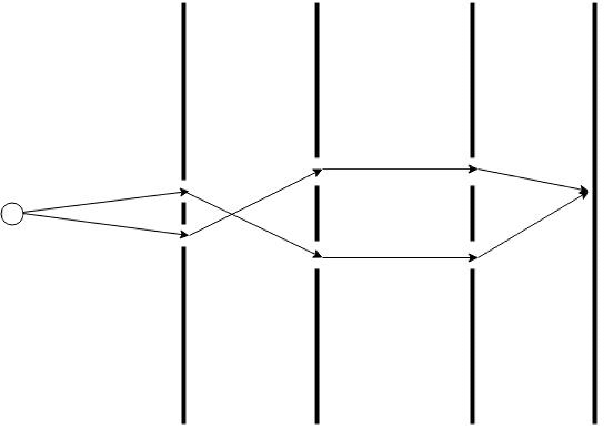

In this post I am going to give a brief introduction to one of the central ideas in theoretical physics.
Quantum field theory might seem a daunting subject, but behind the intimidating mathematical formulation lies an approachable interpretation for describing physics processes. Like most physicists, I was first taught field theory in the form of canonical quantization. However, I find the alternative approach of the path integral formalism to much more approachable and intuitive. Path integral formulations also exist for statistical mechanics applications, but here I will describe how it is used in quantum mechanics. 

Initially, quantum field theory grew out of an attempt to reconcile special relativity with Quantum Mechanics. While Quantum Mechanics describes quantum *states* and their evolution and interaction, central to Quantum Field Theory are the *fields* whose behavior are described by the Lagrangian and the Euler-Lagrange field equations. These fields then act on states, possibly creating and annihilating quanta (or particles) of the field. Using the path integral of the field it is possible to calculate probabilities for processes that can be observed. Quantum field theories are able to explain particle interaction and the creation and annihilation of particles that does not occur in standard quantum mechanics making such theories much more flexible. The Standard Model is built in terms of quantum field theories, where each fundamental particle is described by a field.

There are plenty of good resources for learning about quantum field theory and path integrals, but I will rely heavily on the book by @zee2010quantum. It is an excellent introduction to the subject and I highly recommend it.

## Path Integrals in Quantum Mechanics
The underlying principle of the path integral approach is that all possible paths of evolution from the initial to final state are considered. When a quantum state evolves from one state to another, we consider and incorporate all contributions from all possible paths into a final amplitude that describes the process. The advantage of the path integral method in quantum mechanical calculations is that it provides a simpler method of calculating certain processes, and in particular it gives a much more elegant way of approaching field theory. I will start by following @mackenzie2000path. 

The path integral determines the amplitude of evolving from one state to another. Quantum mechanically, the amplitude for this is

$$
M=\bra{q'}e^{-iHT}\ket{q}.
$$

Where I have used the notation $\bra{q'}$ to signify the state at time $T$ and $\ket{q}$ to signify the state at time $0$. The Hamiltonian $H$ is the operator that governs the evolution of the system. The amplitude $M$ is a complex number that gives the probability of evolving from state $\ket{q}$ to state $\bra{q'}$ in time $T$.

## Paths in quantum mechanics

Consider a quantum mechanical particle with quantum state $\psi$ at position $x_i$ at time $t_i$. We find this from the inner product of the eigenstate of the initial position/time with the particle's state vector. This simple system can be written in bra-ket notation by

$$
\langle x_i, t_i | \psi \rangle = \Psi(x_i, t_i)
$${#eq-init}

The capital psi has been used to denote the wavefunction as a funciton of the position, and we find the probability of the particle being at this position by the Born rule. $
|\Psi|^2 $

The key task in using path integrals in this quantum mechanical context is to find the probability amplitude of a particle moving from an initial point $x_i$ at time $t_i$ to another point $x_f$ at a later time $t_f$. The probability amplitude is found by summing over all possible paths, weighted in such a way that it converges to the classical result in limit $\hbar \to 0$.

Now let us introduce the path integral from the start point to the end point. The cursive D represents a small change over the path and S is the action.
$$
\langle x_f, t_f | x_i, t_i \rangle = \int \mathcal{D}x(t) \, e^{\frac{i}{\hbar} S[x(t)]}
$${#eq-pathint}
$$
S[x(t)] = \int_{t_i}^{t_f} dt \, L(x(t), \dot{x}(t))
$$
These integrals arise from the time evolution of a system subject to a Lagrangian $L$; this therefore encodes the equations of motion we expect the system to satisfy. From these equations we can see that in the limit $\hbar \to 0$, the phase factor oscillates rapidly so that nearly all paths cancel except for the classical path that minimizes the action. This construct is in fact our **propagator**.
$$
K(x_f, t_f; x_i, t_i) = \langle x_f, t_f | x_i, t_i \rangle
$${#eq-prop}
We will see it acts as a weighting factor in our calculations of the probability amplitude. In effect, the propagator weights particular paths, so that in the classical limit only the path that minimizes the action remains. 

What is the wavefunction of the final state? We can make the link between the final state wavefunction and the propagator by using the completeness relation
$$
\int | x_i, t_i \rangle \langle x_i, t_i | dx_i = \textbf{1}.
$$
This statement simply expresses that the sum over all positions at that time should sum to the identity operator. With this we can write the final-state wavefunction as
$$
\Psi(x_f, t_f) = \langle x_f, t_f | \psi \rangle = \int \langle x_f, t_f | x_i, t_i \rangle \langle x_i, t_i | \psi \rangle dx_i
$$
Note we can re-write this using #eq-init and #eq-prop in the form such that the propagator acts as a Green's function
$$
\Psi(x_f, t_f) = \int K(x_f, t_f; x_i, t_i)  \, \Psi(x_i, t_i) dx_i
$$

But what about the time evolution? The time evolution arises from the Schrödinger equation,
$$
i \hbar \frac{\partial | \psi \rangle}{\partial t} = \hat{H} | \psi \rangle
$$
where $\hat{H}$ is the Hamiltonian. This is the equation that determines the time evolution of a quantum state, and if we calculate #eq-pathint for the case of the Schrödinger Lagrangian, the propagator for some small time duration $\Delta t$ is
$$
K = \langle x_f | e^{-\frac{i \hat{H} \Delta t}{\hbar}} | x_i \rangle
$$
What if we go further, and split the time duration between $t_i$ and $t_f$ into many $N$ parts,
$$
\Delta t = \frac{t_f - t_i}{N}
$$

In this case the propagator can be seen as the accumulation of many little contributions from lots of paths
$$
\langle x_f, t_f | x_i, t_i \rangle = \int \langle x_f, t_f | x_N, t_N \rangle \cdots  \langle x_2, t_2 | x_1, t_1 \rangle  \langle x_1, t_1 | x_i, t_i \rangle dx_N \cdots dx_2 dx_1
$$

This is reminiscent of the double slit experiment in which light is fed through two slits. If there are two slits (@fig-doubleslit), there are two possible paths, and two corresponding factors, but as extra slits are added the number increases. 

::: {#fig-doubleslit layout-ncol=3}

{width=2in}

{width=5in}

{width=3in}

The double slit experiment with one, two and three barriers. The number of paths increases with the number of barriers.
:::

We can extend the analogy of barriers in a double slit experiment to time steps in an evolution from one state to another. If we look at one of these little contributions, we can can Taylor expand the exponent. 
$$
\langle x_1 | e^{-i \hat{H} \Delta t / \hbar} | x_0 \rangle = \langle x_1 | \left[1 - \frac{i \hat{H} \Delta t}{\hbar} + \mathcal{O}(\Delta t^2) \right] | x_0 \rangle
$$
$$
= \delta(x_1 - x_0) - \frac{i \Delta t}{\hbar} \langle x_1 | \hat{H} | x_0 \rangle + \mathcal{O}(\Delta t^2) 
$$
and let us quickly transform into momentum space
$$
= \frac{1}{2\pi} \int dp \, e^{i p (x_1 - x_0)} \left[ 1 - \frac{i \Delta t}{\hbar} H(p, x_1) \mathcal{O}(\Delta t^2) \right]
$$
$$
= \frac{1}{2\pi} \int dp \, \exp \left\{ \frac{i \Delta t}{\hbar} \left[ p \frac{x_1 - x_0}{\Delta t} - H(p, x_1) \right] \mathcal{O}(\Delta t^2) \right\}
$$
in the limit of $N \to \infty$
$$
\langle x_n, t_n | x_0, t_0 \rangle = \int dp_0 \prod_{k=1}^{n-1} \frac{dp_k \, dx_k}{2\pi} \exp \left[ i \sum_{j=0}^{n-1} \Delta t \left( p_j \frac{\Delta x_j}{\Delta t} - H_j \right) \right]
$$
$$
\Rightarrow \int [dx][dp] \exp \left\{ i \int dt \left[ p \dot{x} - H(p, x) \right] \right\}
$$
where
$$
[dx][dp] = \prod_{i=1}^{n-1} dx_i \, dp_i \cdot dp_0
$$
and the integral over momenta can be reverse-transformed, and the Hamiltonian written out in full.
$$
\frac{1}{\hbar} \int dp \, e^{i \Delta t \left[ p \frac{\Delta x}{\Delta t} - H \right]} = \left( \frac{m}{2\pi i \hbar \Delta t} \right)^{1/2} \exp \left[ i \Delta t \left( \frac{m}{2} \left( \frac{\Delta x}{\Delta t} \right)^2 - V \right) \right]
$$
So
$$
\langle x_n, t_n | x_0, t_0 \rangle = N \int \prod_{i=1}^{n-1} dx_i \, \exp \left( i \int dt \, L \right)
$$
with
$$
N = \lim_{n \to \infty} \left( \frac{m}{2\pi i \hbar \Delta t} \right)^{n/2}
$$
Altogether we have finally reached the derivation of the path integral in quantum mechanics (where the cursive D has absorbed the prefactors and product over i)
$$
\langle x_f, t_f | x_0, t_0 \rangle = \int \mathcal{D}x \, e^{\frac{i}{\hbar} S[x(t)]}
$$

## Path Integrals in Quantum Field Theory
To move from quantum mechanics the quantum field theory, only a small change is needed to the path integral. In quantum field theory the states are no longer the basic objects; they are replaced by fields that act on vacuum states to create particles. 

It is now the Lagrangian density that appears in the action. The Lagrangian density is a function of the field and its derivatives rather than the position and momentum of a particle as in the quantum mechanical case. The variable q in the path integral is replaced by the field $\phi$, the index j becomes a continuum and the path integral is no longer taken as the evolution between two states $\ket{q},\ket{q'}$ but between two vacuum states, $\ket{0}$. This is only convention and represents the fact it is possible to create any state by acting the field operator on the vacuum. So the path integral becomes

$$
Z=\int D\phi e^{i\int \mathcal{L}d^4 x}
$$   

The question now with the path integral in quantum field theory is how to use it to find observables. The key component one can find from the path integral is the propagator, which gives the probability of a particle moving from one point to another. The propagator is derived from the action and is a central object in quantum field theory.

## The Propagator
The square of the absolute value of the propagator gives us the probability of a particle moving from one place to another (hence *propagation*) and is derived from the governing equation of the field. The path integral for a scalar field theory is (lower case letters like x, y signify 4-vectors)

$$
Z=\int D\phi e^{iS}
$$

where D signifies the integration measure that includes the product, limit etc. S is the action given by

$$
S=\int d^4 x \dfrac{1}{2} (\partial_\mu \phi \partial^\mu \phi -m^2\phi^2)+J\phi.
$$

Where J is some source function and $\mu \in(0,1,2,3,4)$. To calculate the propagator first one must focus on the action and integrate by parts to get

$$
\int d^4 x \left[ -\phi\frac{1}{2}(\partial_\mu \partial^\mu +m^2)\phi +J\phi\right].
$$

Then use the Green's function form

$$
(\partial_\mu \partial^\mu +m^2)D(x-y)=-\delta^{(4)}(x-y)
$$

such that the field satisfies

$$
\phi(x)=\int d^4 y D(x-y)J(y)
$$

and putting this form into the action above, the result is

$$
\frac{1}{2}\int d^4 x \int d^4 y J(x) D(x-y) J(y) 
$$

and using Fourier transforms shows the explicit appearance of the propagator

$$
\tilde{D}(k)=\dfrac{1}{k^2-m^2}
$$

where the denominator can be replaced by whatever dispersion relation that follows the simple scalar field in Minkowski space form i.e just add extra positive terms for time-like dimensions and negative ones for space-like dimensions.

## The Potential
A simple application of the propagator is to calculate the potential between two particles. The potential is a measure of the interaction between particles and can be derived from the propagator. In quantum field theory, the potential is not a fundamental quantity but rather an emergent one that arises from the interactions of particles. The potential can be found by taking the spatial Fourier transform of the propagator. The hardest and perhaps most important part is how the sources and sinks are set up in the calculation of a potential. In the path integral formulation this must be done to allow a potential to appear, after all there can be no propagator and hence no potential without anything to propagate between.

As a first example the potential will derived in 3+1 dimensions using a source function that consists of two Dirac delta sources $J(x)=\delta^{(3)}(\vec{x}-\vec{x_1})+ \delta^{(3)}(\vec{x}-\vec{x_2})$. These are fixed at the spatial positions $\vec{x_1}$ and $\vec{x_2}$. There will be a number of terms in the action arising from the product of the two source functions but since the only interesting one is where a particle is created at 1 and annihilated at 2 the only one that is considered is

$$
S=-\dfrac{1}{(2\pi)^4} \int d^4 x' \int d^4 x \int d^4 k \dfrac{\delta(\vec{x}-\vec{x_1}) e^{ik\cdot(x-x')} \delta(\vec{x'}-\vec{x'_2})}{\omega^2-k^2-m^2}
$$ 

Where the sources are placed at a particular position in space but have no fixed time coordinate. This leads to

$$
\begin{aligned}
S&=-\dfrac{1}{(2\pi)^4} \int dt' \int dt \int d\omega e^{i\omega(t-t')} \int d^3 k \dfrac{e^{-i\vec{k}(\vec{x_1}-\vec{x'_2})}}{\omega^2-k^2-m^2}\\
&=-\dfrac{1}{(2\pi)^3}\int dt \int d\omega \delta(\omega) \int d^3 k \dfrac{e^{-i\vec{k}(\vec{x_1}-\vec{x'_2})}}{\omega^2-k^2-m^2}\\
&=\dfrac{1}{(2\pi)^3}\int dt \int d^3 k \dfrac{e^{i\vec{k}(\vec{x_1}-\vec{x'_2})}}{k^2+m^2}
\end{aligned}
$$

Letting the time integral be $\int dt=T$ to make the association with the T in $\bra{0} e^{-iHT}\ket{0}=e^{-iET}$ so the potential is (and writing $\vec{x}=\vec{x_1}-\vec{x'_2}$)

$$
\int \dfrac{d^3 k}{(2\pi)^3}\dfrac{e^{i\vec{k}.\vec{x}}}{k^2+m^2}=\frac{1}{4 \pi r}e^{-mr} 
$$ 

Another important point is the validity of fixing the source and sink in space but not in time. When this was done is was clear that a Dirac delta function appeared in $\omega$ that cut out the time-term from the propagator. From the path integral approach as described in @zee2010quantum the specification of the sources and sinks is essential to correctly calculate the potential arising from particle propagation from source to sink. 

This form of potential between two particles is called the Yukawa potential. It acts as the familiar Coulomb potential for massless particles, but for massive particles the potential is exponentially suppressed at large distances.

## Conclusion

In this brief intro I have mentioned some high-level concepts such as Green's functions, four-vectors and the Lagrangian density. These are all important concepts in quantum field theory and this post shouldn't be seen as a comprehensive guide, but rather a jumping off point to explore these ideas further. The path integral approach to quantum field theory is a powerful tool that allows for the calculation of probabilities and potentials in a way that is I think is more intuitive than the canonical quantization approach. It is a central part of the modern understanding of particle physics and is essential for understanding the Standard Model.