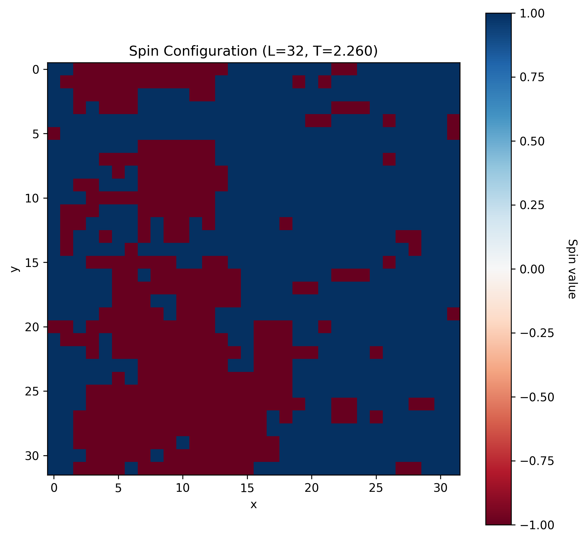
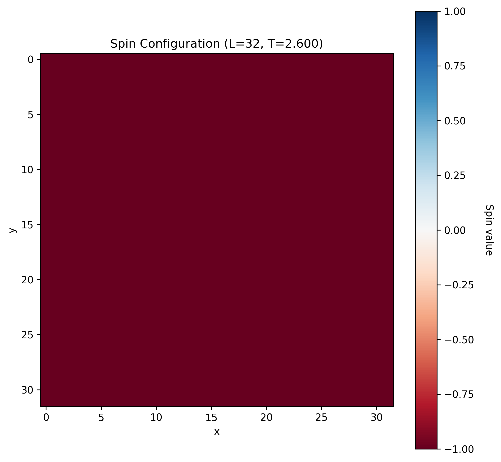

The Ising model stands as one of the most important models in statistical mechanics, providing a simple yet powerful framework for understanding magnetic phase transitions and critical phenomena. Named after Ernst Ising, who proposed it in his 1925 doctoral thesis, the model has found applications far beyond magnetism, serving as a paradigm for studying phase transitions in diverse systems from binary alloys to neural networks. In previous posts I have briefly introduced the model, but in this post I will explore the theoretical foundations of the Ising model, derive its key thermodynamic properties, and discuss the implementation of Monte Carlo simulations to study its behavior.

The beauty of the Ising model lies in its simplicity: it reduces the complex quantum mechanical problem of interacting spins to a classical statistical mechanics problem. Despite this simplification, the model exhibits important physical phenomena, including spontaneous magnetization, critical behavior, and universality. The two-dimensional Ising model was famously solved exactly by Lars Onsager in 1944, providing one of the few examples of an exactly solvable model with a phase transition. However, for general geometries and in higher dimensions, numerical simulations remain essential for understanding the model's behavior.

The primary reference for this discussion is @shekaari2021theory, which provides comprehensive coverage of both the theoretical foundations and computational approaches to the Ising model. For additional background on statistical mechanics and phase transitions, readers may also consult standard textbooks such as Statistical Mechanics by @huang2021statistical.

# Theoretical Foundation

## The Ising Hamiltonian

The Ising model consists of a regular lattice with discrete spin variables at each site. Consider a lattice $\Lambda = \{1, 2, \ldots, N\}$ where each site $i$ contains a spin variable $\sigma_i \in \{-1, +1\}$. The state of the entire system is described by a spin configuration $\{\sigma\} = \{\sigma_1, \sigma_2, \ldots, \sigma_N\}$.

The Hamiltonian (energy function) of the system is given by:

$$
H[\{\sigma\}] = -J \sum_{\langle i,j \rangle} \sigma_i \sigma_j - h \sum_i \sigma_i
$$ {#eq-hamiltonian}

Here, the first sum runs over all nearest-neighbor pairs $\langle i,j \rangle$, $J$ is the coupling constant that determines the strength of interaction between neighboring spins, and $h$ is an external magnetic field. The coupling constant $J$ determines the nature of the magnetic interaction:

- $J > 0$: Ferromagnetic coupling, favoring aligned spins
- $J < 0$: Antiferromagnetic coupling, favoring anti-aligned spins
- $J = 0$: Non-interacting spins

The ground state of the ferromagnetic Ising model ($J > 0, h = 0$) corresponds to all spins aligned in the same direction, either all $+1$ or all $-1$, giving an energy of $E_0 = -J \times (\text{number of nearest-neighbor pairs})$.

## Statistical Mechanics Framework

At finite temperature $T$, the system is described by the canonical ensemble. The probability of finding the system in an arbitrary particular configuration $\{\sigma\}$ is given by the Boltzmann distribution:

$$
P[\{\sigma\}] = \frac{1}{Z} \exp(-\beta H[\{\sigma\}])
$$ {#eq-boltzmann}

where $\beta = 1/(k_B T)$ is the inverse temperature and $Z$ is the partition function:

$$
Z = \sum_{\{\sigma\}} \exp(-\beta H[\{\sigma\}])
$$ {#eq-partition}

The sum runs over all $2^N$ possible spin configurations. The partition function encodes all thermodynamic information about the system and allows us to calculate observables as ensemble averages.

## Thermodynamic Quantities

### Internal Energy and Magnetization

The internal energy and magnetization are given by the ensemble averages:

$$
U = \langle H \rangle = -\frac{\partial \log Z}{\partial \beta}
$$ {#eq-internal-energy}

$$
M = \left\langle \sum_i \sigma_i \right\rangle = \frac{\partial \log Z}{\partial(\beta h)}
$$ {#eq-magnetization}

The magnetization per site is $m = M/N$, which serves as the order parameter for the ferromagnetic phase transition.

### Response Functions

The magnetic susceptibility and heat capacity characterize the system's response to external perturbations:

$$
\chi = \frac{\partial M}{\partial h}\Big|_T = \beta(\langle M^2 \rangle - \langle M \rangle^2) = \beta N \text{Var}(m)
$$ {#eq-susceptibility}

$$
C_V = \frac{\partial U}{\partial T}\Big|_h = \frac{1}{k_B T^2}(\langle H^2 \rangle - \langle H \rangle^2) = \frac{\beta^2}{N} \text{Var}(H)
$$ {#eq-heat-capacity}

The form of these definitions comes directly from the thermodynamic relations (such as the Maxwell relations), and show how macroscopic thermodynamic properties emerge out of statistical systems. These quantities exhibit characteristic behavious at phase transitions. Near the critical temperature, both $\chi$ and $C_V$ show power-law divergences, indicating the critical behavior of the system.

## Correlation Functions and Critical Behavior

The spin-spin correlation function measures correlations between spins at different sites:

$$
G(r) = \langle \sigma_0 \sigma_r \rangle - \langle \sigma_0 \rangle \langle \sigma_r \rangle
$$ {#eq-correlation}

where $r$ is the distance between sites. Due to translational invariance, $G(r)$ depends only on the separation $r$, not on the absolute positions. Near the critical temperature, the correlation function exhibits power-law behavior at short distances and exponential decay at long distances:

$$
G(r) \propto \begin{cases}
r^{-(d-2+\eta)} & \text{for } r \ll \xi \\
\xi^{-(d-2+\eta)/2} \exp(-r/\xi) & \text{for } r \gg \xi
\end{cases}
$$ {#eq-correlation-scaling}

where $d$ is the spatial dimension, $\eta$ is a critical exponent, and $\xi$ is the correlation length. The correlation length diverges at the critical point as $\xi \propto |T - T_c|^{-\nu}$, where $\nu$ is another critical exponent. 

## Phase Transition

The Ising model exhibits a phase transition between a disordered paramagnetic phase at high temperatures and an ordered ferromagnetic phase at low temperatures. The critical temperature $T_c$ separates these phases:

- **High temperature ($T > T_c$)**: Paramagnetic phase with $\langle m \rangle = 0$ and short-range correlations
- **Low temperature ($T < T_c$)**: Ferromagnetic phase with spontaneous magnetization $\langle m \rangle \neq 0$

For the two-dimensional Ising model on a square lattice, the exact critical temperature is:

$$
\frac{k_B T_c}{J} = \frac{2}{\ln(1 + \sqrt{2})} \approx 2.269
$$ {#eq-critical-temp}

This exact result, derived by Onsager, represents a excellent example of the powerful results that can be derived from purely analytic methods.

# Monte Carlo Simulation

The difficulty with the Ising model howeve ris going beyond this simplified system. While analytic results are powerful, we need numerical methods to explore the full parameter space and phenomena hidden in these statistical systems arising from complex interactions.

## The Challenge of Direct Computation

Direct computation of thermodynamic quantities requires summing over all $2^N$ spin configurations, which becomes computationally intractable for even modest system sizes. For a $100 \times 100$ lattice, this would require summing over $2^{10,000}$ configurations—a number far exceeding the number of atoms in the observable universe.

Monte Carlo methods provide an elegant solution by sampling only the statistically important configurations according to their Boltzmann weights. Instead of computing the full sum, we estimate ensemble averages as:

$$
\langle A \rangle \approx \frac{1}{M} \sum_{i=1}^M A(\{\sigma\}^{(i)})
$$ {#eq-mc-average}

where $\{\sigma\}^{(i)}$ are configurations sampled from the Boltzmann distribution, and $M$ is the number of samples. The key to this numerical problem is in selecting only those configuration that are important.

## The Metropolis Algorithm

The Metropolis algorithm, introduced by Metropolis et al. in 1953, provides a method for sampling configurations according to the Boltzmann distribution. The algorithm satisfies detailed balance, ensuring that the equilibrium distribution is the desired Boltzmann distribution.

### Algorithm Steps

1. **Initialize**: Start with a random spin configuration $\{\sigma\}$
2. **Propose**: Randomly select a spin $\sigma_i$ and propose flipping it: $\sigma_i \to -\sigma_i$
3. **Calculate**: Compute the energy change $\Delta E = H(\text{new}) - H(\text{old})$
4. **Accept/Reject**: 
   - If $\Delta E \leq 0$, accept the move
   - If $\Delta E > 0$, accept with probability $p = \exp(-\beta \Delta E)$
5. **Repeat**: Continue until sufficient statistics are collected

The acceptance probability ensures detailed balance:

$$
\frac{P(\{\sigma'\} \to \{\sigma\})}{P(\{\sigma\} \to \{\sigma'\})} = \frac{P_{\text{eq}}(\{\sigma\})}{P_{\text{eq}}(\{\sigma'\})} = \exp(-\beta(H[\{\sigma\}] - H[\{\sigma'\}]))
$$

### Efficient Energy Calculation

A key optimization in Ising simulations is the efficient calculation of energy changes. When flipping spin $\sigma_i$, only the interactions with its nearest neighbors contribute to $\Delta E$:

$$
\Delta E = 2\sigma_i \left( J \sum_{j \in \text{nn}(i)} \sigma_j + h \right)
$$ {#eq-delta-e}

For a 2D square lattice with periodic boundary conditions, each spin has exactly four nearest neighbors, so:

$$
\Delta E = 2\sigma_i \left( J(\sigma_{i+1,j} + \sigma_{i-1,j} + \sigma_{i,j+1} + \sigma_{i,j-1}) + h \right)
$$

In the absence of an external field ($h = 0$), there are only five possible values for $\Delta E$: $\{-8J, -4J, 0, 4J, 8J\}$, corresponding to different local spin environments. This allows for pre-computation of acceptance probabilities, further optimizing the algorithm.

### Boundary Conditions

Periodic boundary conditions are typically employed to minimize finite-size effects:

$$
\sigma_{i+L,j} = \sigma_{i,j}, \quad \sigma_{i,j+L} = \sigma_{i,j}
$$

where $L$ is the linear size of the system. This can be implemented efficiently using modular arithmetic: for a site at position $i$, its neighbor at $i+1$ is located at position $(i+1) \bmod L$.

## Observables and Measurements

During the simulation, we measure various observables:

### Magnetization
$$
m = \frac{1}{N} \sum_i \sigma_i
$$ {#eq-measured-mag}

### Energy per site
$$
e = \frac{H}{N} = -\frac{J}{N} \sum_{\langle i,j \rangle} \sigma_i \sigma_j - h m
$$ {#eq-measured-energy}

### Magnetic Susceptibility
$$
\chi = \beta N (\langle m^2 \rangle - \langle |m| \rangle^2)
$$ {#eq-measured-chi}

### Heat Capacity
$$
C_V = \frac{\beta^2}{N} (\langle H^2 \rangle - \langle H \rangle^2)
$$ {#eq-measured-cv}

## Equilibration and Autocorrelation

Monte Carlo simulations require careful attention to equilibration and statistical independence:

1. **Equilibration**: The system must be allowed to reach thermal equilibrium before measurements begin. This typically requires $10^3$ to $10^4$ Monte Carlo sweeps.

2. **Autocorrelation**: Successive configurations are correlated. Measurements should be taken every $\tau$ sweeps, where $\tau$ is the autocorrelation time.

3. **Finite-size scaling**: Results depend on system size. Critical behavior is studied by analyzing how observables scale with system size $L$.

# An Ising Simulator

To illustrate the implementation and simulation of these systems, I have created a simple python package that implements the Metropolis-Hastings algorithm for the Ising model system [@watkins2025]. This code uses the standard python stack with a user-friendly CLI interface to run Ising model simulations and scans on the command line. For example, I can study a system close to the critical temperature of the Ising system with

```bash
ising --single --size 32 --temperature 2.26 --plot --visualize --save-plots
```

{}


And if we run the system under a magnetic field, we can see how the system responds to the field with
```bash
ising --single --size 32 --temperature 2.6 --field 0.05  --visualize --save-plots --plot
```

{}


# Conclusion

The Ising model represents a cornerstone of statistical mechanics, bridging the gap between microscopic interactions and macroscopic thermodynamic behavior. Its exact solvability in two dimensions provides crucial insights into critical phenomena, while Monte Carlo simulations allow exploration of finite-size effects, dynamics, and extensions to more complex models. The Monte Carlo approach, particularly the Metropolis algorithm, demonstrates the power of stochastic methods in theoretical physics. By sampling configurations according to their statistical weights rather than enumerating all possibilities, we can study systems that would otherwise be computationally intractable. Modern applications of Ising-type models extend far beyond traditional magnetism, finding use in machine learning (Hopfield networks, Boltzmann machines), social dynamics, financial modeling, and biological systems. The computational techniques developed for the Ising model continue to inform approaches to complex many-body problems across diverse fields of science and engineering. The Ising system is a great way to start studying statistical mechanics systems in physics, both from a theoretical and computational starting point, and shows how intertwined the theoretical and computational sides of physics are.