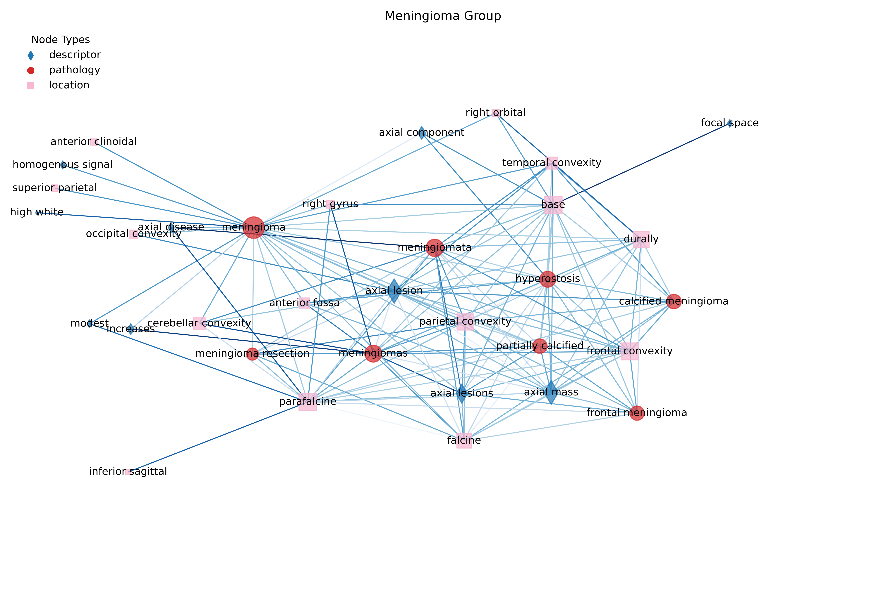
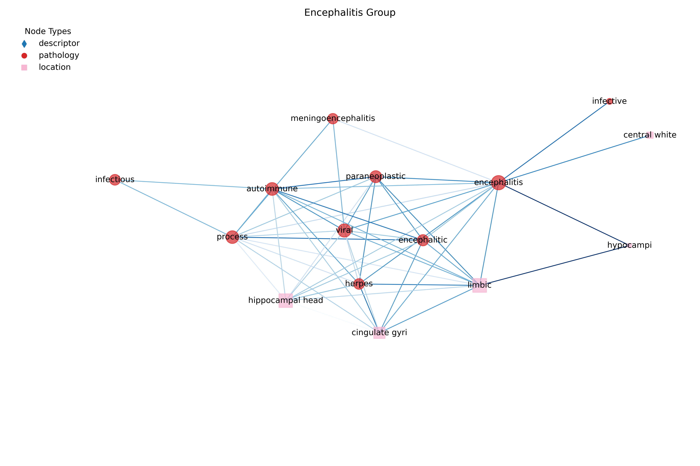
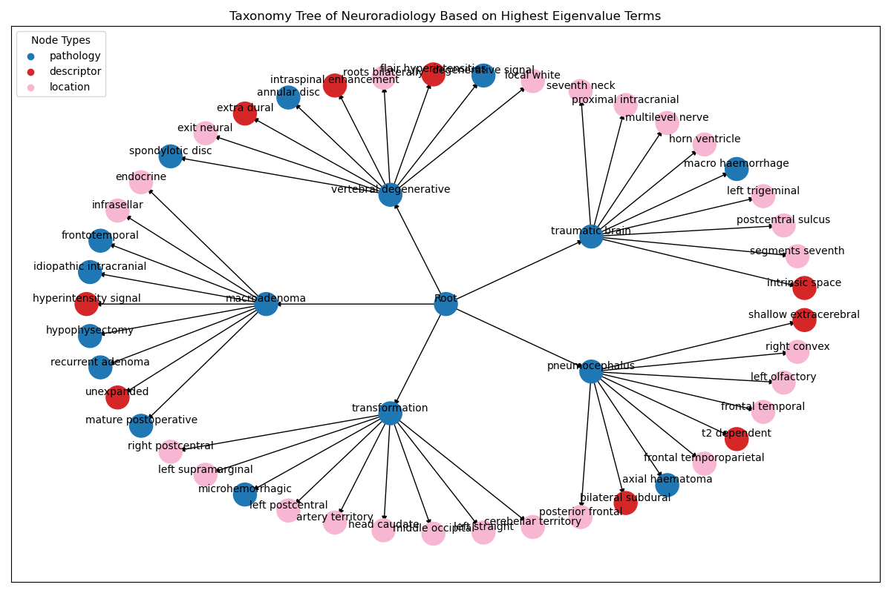

Understanding how neurological conditions are described in medical literature is critical for improving communication, advancing research, and enhancing patient care. Neurological descriptions often involve complex, nuanced language, which can obscure underlying relationships between conditions and treatments. By leveraging computational approaches to analyse these descriptions, we can uncover semantic patterns that enhance our understanding of neurological discourse. In this post I am going to describe some work I completed as part of a fellowship project this year. The aim is to build a network of terms from neurological descriptions using point-wise mutual information (PMI) and applies graphical modelling to identify key semantic structures. I isolate an ontological structure from reporting in an unsupervised manner, find key patterns of presentation, and find the key correlates of disorders with their description.

Unstructured text in radiological reports poses significant barriers to effective diagnosis and clinical standardisation. Neurological radiological reports, in particular, contain diverse terminology and data linked to complex conditions such as strokes and epilepsy. Despite their richness, these reports lack standardised frameworks for terminology usage, making it difficult to extract actionable insights or ensure consistency across clinical settings. Advances in natural language processing, particularly transformer-based models like BERT have shown promise in analysing medical texts. However while these approaches have been applied to general radiology or specific imaging modalities like chest X-rays, their application to neurological radiological reports remains limited.

A large part of the Guarantors of Brain project involved building tools for analysing and understanding the language used in neurological reports. A small part of which builds on prior work by integrating language model-derived embeddings with graph-based analytical techniques to uncover latent structures within neurological radiological reports. By identifying clusters of terms and analysing their relationships through co-occurrence graphs, we can reveal diagnostic patterns and terminology usage variations that can inform clinical practice and standardisation efforts. In this project, I find the distinct meta-language of neuroradiology. It aims to uncover diagnostic patterns and terminology usage in neurology by analysing co-occurrence graphs and clustering neurological terms. 

In short, understanding latent structures in radiological reports can:

* Improve diagnostic accuracy by identifying patterns in terminology usage.
* Standardise medical language, reducing inconsistencies across clinical settings.
* Enhance knowledge representation for electronic health records (EHRs), enabling better decision-making tools for clinicians.

The approach begins with the extraction of terms and phrases from a corpus of neurological texts, followed by the computation of PMI to identify statistically significant co-occurrences of terms. These co-occurrences are represented as a weighted graph, where nodes are terms and weighted edges reflect their mutual information. A graph model is trained on this graph to identify higher-order structures and patterns. Semantic sub-networks can be extracted and analysed, focusing on the relationships between conditions, interventions, and descriptors. We extracted terms and phrases from a large corpus of neurological texts—including over 300,000 MRI head scans collected during 25 years of clinical practice at Queen Square—to capture the diverse language used in radiological reports. High PMI values might indicate meaningful relationships, such as common co-morbidities or symptom-disease relationships.

With the graph constructed, we can then move onto applying node clustering algorithms. I used soft Louvain clustering to identify communities within the network, allowing for the detection of non-exclusive thematic groups. Unlike traditional Louvain clustering, soft Louvain clustering ascribes a probability of membership to each node in the graph, therefore I can use this parameter to find non-exclusive communities of nodes in the graph. The value of non-exclusive community detection is that it allows each node to belong to more than one community. This is certainly the case for non-specific terminology such as "inflammation" that can co-occur alongside multiple different conditions or diagnoses. These communities might correspond to thematic areas within a corpus, such as specific branches of medicine or research clusters. Investigating these communities can reveal how different topics are interconnected and identify potential interdisciplinary research areas. A threshold was applied to aggregate nodes for clarity, while Eigenvector Centrality was used to pinpoint the most influential terms within each cluster. These high-centrality primary nodes served as the “head” terms in an ontology, with the associated clusters forming templates that describe pathological conditions, imaging presentations, and key anatomical locations.

In addition to community detection, other graph metrics such as the clustering coefficient can be applied to the terminology graph to uncover structure. High clustering coefficients suggest the presence of specialised subtopics or highly focused areas within the medical texts. These cliques could represent highly interconnected fields, such as specific diseases with multiple associated symptoms or treatments.

## Results

The analysis reveals distinct semantic clusters corresponding to different neurological conditions, such as oncological and degenerative diseases. Sub-networks highlight how oncological conditions are interrelated through shared descriptors, suggesting potential overlaps in diagnostic and therapeutic approaches. Here I show four example sub-graphs extracted from the larger terminology graph. 

{#fig-meningioma}

@fig-meningioma shows a large semantic sub-graph identified with the Meningioma term. The blue, red and pink nodes represent pathological, descriptive and location terms respectively. With this layout, we can identify the primary terminology concurrent with meningiomas (the direct connections to meningioma terms) and also the second-order terminology. @fig-encephalitis shows the encephalitis group, which is a cluster of terms related to encephalitis, a condition characterised by inflammation of the brain. 

{#fig-encephalitis}

@fig-aneurysm shows the aneurysm sub-graph. This sub-graph is smaller and was extracted using a higher probability threshold in the Louvain community detection routine. As such, this group represents a much tighter terminology set associated with aneurysms. @fig-taxonomy shows a small subset of the whole ontology created by identifying the high-centrality terms (which define sub-specialities) and their constituent terminology that defines their wider presentation. This method provides an entirely data-driven approach to creating ontologies directly from medical text, without the need for manual curation or a-priori input.

{#fig-aneurysm }

{#fig-taxonomy}

{#fig-demyelination}

{#fig-stroke}

By identifying key semantic structures in neurological descriptions, this approach provides insights into medical language that can improve patient care and support research. This method is also flexible enough to be applied to other domains of medical and scientific text, bridging the gap between unstructured data and actionable knowledge. With this approach, I can (1) identify clusters of related terms and provide insights into diagnostic patterns that can aid clinicians in recognising complex conditions more effectively. (2) The observed inconsistencies underscore the need for standardised medical language across clinical settings. Standardization could improve communication among healthcare professionals and reduce diagnostic variability. (3) Insights from co-occurrence graphs can inform better knowledge representation within EHR systems by highlighting key terms and their relationships. (4) Variations in terminology usage across demographics suggest potential biases that should be addressed to ensure equitable care. (5) Expanding this approach to other medical domains or integrating multimodal data (e.g., imaging features) could further enhance its applicability. Additionally, exploring advanced graph neural networks could provide deeper insights into term interconnections.

The full report and further details can be found in our [preprint](https://arxiv.org/abs/2506.06208), [@watkins2025buildingmodelsneurologicallanguage].