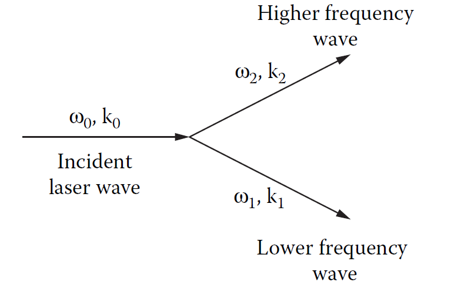

# Plasma-Laser Coupling {#sec-laserplasma}

The interaction between a laser field and a plasma exhibits a stunning array of complex phenomena across a range of length and time scales. The laser-plasma coupling processes are crucial for understanding how energy and momentum are transferred from the laser to the plasma, which in turn affects the dynamics of the plasma and the efficiency of energy deposition. In this chapter we will discuss the fundamental processes of laser-plasma coupling, including the ponderomotive force and inverse bremsstrahlung, as well as the parametric instabilities that can arise in these interactions. We will also explore how non-locality and magnetisation affect laser propagation and energy deposition in plasmas. These are only a small subset of the wide range of processes that can occur in laser-plasma interactions, but they are the most relevant to the regimes of interest of this book. 

The plasmas of interest here are all produced by long pulse lasers with a laser wavelength of $\lambda_l= 1 \mu m$. As such the laser intensity is moderate, with a peak intensity around $10^{15} W cm^{-2}$ and a laser-plasma coupling parameter $I\lambda_l^2$ in the region of $10^7 W$. To get a measure for the importance of special relativistic effects in laser-plasma coupling, one can consider the magnitude of the electron quiver speed $v_{osc}$, this is the speed of oscillation of an electron in the electric field of the laser. With intensities this low, relativistic effects can be ignored since the electron quiver speed relative to the speed of light
$$
\frac{v_{osc}}{c}=\frac{eE}{m_e \omega_l c} = a_0,
$$
is of the order $O(10^{-2})$, so the electron motion is firmly non-relativistic. The term $a_0$ is known as the normalised vector potential, and is commonly used in the theory of laser-plasma interactions.

@sec-mhd introduced the concept of the plasma frequency $\omega_p$, which is the characteristic frequency at which the electron fluid restores quasi-neutrality in a plasma. This provides a lower limit to the frequencies of electromagnetic radiation can propagate through a plasma. When the laser frequency $\omega_l$ equals $\omega_p$, the electron current in the plasma can cancel the displacement current in Ampere's law, effectively quenching the electric field of the laser. The length scale of this attenuation is called the *skin depth* and is defined
$$
\delta =\frac{c}{\omega_p}
$$
The limit on frequency also defines an important parameter of laser-plasma interactions, the critical density $n_c$. This is the cut-off electron density at which the plasma frequency equals the laser frequency. Using the definition of the plasma frequency, this density is defined
$$
n_c=\frac{\epsilon_0 m_e \omega_l^2}{e^2}.
$$

While there are other mechanisms by which lasers can couple to a plasma and exchange energy, the parameter space of interest in this thesis limits the coupling to the most significant processes in ICF regimes.

An additional and important consideration in laser-plasma coupling is the gradient scale length near the critical surface, often characterised by the ratio $L_n/\lambda_l$​, where $L_n=|\nabla n_e/n_e|^{-1}$ is the density scale length. This gradient strongly influences absorption efficiency and laser beam propagation. For example, when the scale length is long compared to the laser wavelength, laser energy can penetrate deeper into the plasma before being reflected or absorbed—a regime conducive to inverse bremsstrahlung heating. In contrast, sharp gradients near the critical surface enhance reflection and can seed parametric instabilities like stimulated Raman or Brillouin scattering, which redirect laser energy into plasma waves or backscatter it out of the target. These processes are highly sensitive to laser intensity, polarisation, and the spatial profile of both the plasma and the laser beam. Additionally, laser filamentation and self-focusing can occur when small fluctuations in the refractive index (linked to $n_e$ ​) cause parts of the beam to intensify and locally modify the plasma, creating nonlinear feedback. Understanding these scale-dependent and nonlinear mechanisms is essential for predicting how much laser energy is deposited in the plasma and where, which in turn affects ablation pressure and shock formation.

## The Ponderomotive Force

The ponderomotive force is the result of the collective oscillation of the electrons in the oscillating electric field of the laser. A spatially varying laser electric field envelope drives electrons from regions of high intensity to regions of lower intensity. The timescale of the laser oscillation period is so much higher than the timescale of the dynamics of the plasma, so one can temporally integrate over this collective motion to obtain a ponderomotive potential. Gradients in this potential act as a force in the momentum equation.

The form of the ponderomotive force can be obtained from the second order terms of the electron fluid momentum equation
$$
m_e n_e \frac{\partial \textbf{V}_e}{\partial t}=-m_e n_e\textbf{V}_e\cdot \nabla\textbf{V}_e-e n_e(\textbf{V}_e \times\textbf{B}).
$$
Using the magnetic vector potential $\textbf{B}=\nabla\times\textbf{A}$, and the first order oscillating field (quiver) approximation $\textbf{V}_e=-\frac{e \textbf{E}}{m_e \omega}=\frac{e\textbf{A}}{m_e}$, the momentum equation becomes
$$
    m_e n_e \frac{\partial \textbf{V}_e}{\partial t}=-\frac{1}{2}\frac{e^2 n_e}{m_e \omega_l^2}\nabla A^2.
$$
By integrating out the fast oscillation, this expression yields the ponderomotive force density, which can be written in terms of the laser field envelope $\psi$,
$$
\textbf{F}_p=-\frac{\omega_p^2}{\omega_l^2}\nabla \langle\frac{1}{2}\epsilon_0 E^2\rangle=-\frac{n_e}{n_c}\frac{1}{2}\epsilon_0\nabla|\psi|^2.
$$
This form shows the force as a negative gradient of a potential; on timescales much longer than the laser oscillation period, the ponderomotive force can be thought of as an electric field pressure on the electron fluid. In practice this term is added to the momentum equation of the electron fluid, and acts as a source term for the electron momentum density.

## Inverse Bremsstrahlung

Inverse bremsstrahlung (IB) is the inverse of the bremstrahlung emission process. This is a collisional absorption process, whereby an electron-ion Coulomb collision is caused by the oscillating electric field of the laser forcing the electrons to quiver. In this process a photon of laser light is absorbed by an electron scattered in the field of an ion. IB acts as a source term in the plasma energy equation with energy from the laser light absorbed by the plasma. For underdense plasmas, IB is the primary heating process from laser interactions.

To derive the form of the IB operator, consider the Langdon operator for the $f_0$ equation, defined as
$$
\left( \frac{\partial f_0}{\partial t}\right)_{IB}=\frac{A v^2_{osc}}{3 v^2}\frac{\partial}{\partial v}\left(\frac{g(v)}{v} \frac{\partial f_0}{\partial v}\right).
$$
With $A= \frac{2 \pi n_e Z e^4}{m_e^2}$ and $v_{osc} = \frac{e E_0}{m_e \omega_l}$, where $E_0$ is the laser field. In this model, the oscillating laser field acts as a source term for the isotropic part of electron distribution function.  

The IB heating term in the energy equation can then be derived in the same way as the rest of the energy equation, by taking the correct moment of the Landgon IB operator and using a Maxwellian distribution for $f_0$. The factor $g(v)$ can be assumed to be 1 in the regime within which these equations are derived (where $v_{osc}<<v_{th}$). Therefore, using the definition of the electron-ion collision time $\tau_{ei}$, the laser heating term is
$$
\left( \frac{\partial \mathcal{E}}{\partial t}\right)_{laser}= \frac{\omega_p^2}{\omega_l^2}\nu_{ei}\langle\frac{1}{2}\epsilon_0 E^2\rangle=\frac{n_e}{n_c}\frac{1}{2}\epsilon_0\nu_{ei}|\psi|^2,
$$
where it has been put in terms of the laser field envelope $\psi$.

These two laser-plasma coupling terms allow the laser to deposit energy and momentum in the plasma, while other laser-plasma interactions do exist, on the long-pulse, $1ns$ timescales they are negligible. The above forms also allow the direct use of the slowly-varying laser field envelope $\psi$, calculated from the paraxial equation, in the plasma coupling terms. 

## Parametric Laser-Plasma Instabilities

Parametric instabilities are caused by the non-linear interactions between intense laser light and the plasma. The refractive index of a plasma is dependent on the electron number density, as such, light will refract in regions of inhomogeneous electron density. In particular laser light finds itself refracted into electron density channels. Small density fluctuations scatter laser light, with the intense laser pump wave decaying into two new waves. Depending on the kind of waves that are excited, these instabilities can enhance laser absorption or enhance laser backscatter.

{#fig-LPI}

This three-wave decay process is illustrated in figure \ref{fig:LPI}. Because energy and momentum must be conserved, the incident $(\omega_0, \textbf{k}_0)$ and scattered $(\omega_1,\textbf{k}_1),( \omega_2,\textbf{k}_2)$ waves must satisfy the wavenumber and frequency matching relations
$$
\begin{align}
    \omega_0&=\omega_1+\omega_2,\\
    \textbf{k}_0&=\textbf{k}_1+\textbf{k}_2.
\end{align}
$$
The intensity of the incident wave (i.e the laser) has to exceed a certain threshold in order for the parametric instability to occur, because collisional or collisionless damping will act to damp the growth of an unstable mode. If the laser intensity is higher than this limit, the amplitude of the parametric decay mode grows exponentially with a characteristic growth rate. A high-power pump laser in an ICF or laser-plasma experiment can decay via a number of different parametric instabilities. The processes of interest in the underdense moderate-intensity laser interactions are stimulated Raman scattering and stimulated Brillouin scattering.

### Stimulated Raman Scattering

Stimulated Raman scattering (SRS) is the parametric process where the incident pump wave (with frequency $\omega_0$) decays into an electron plasma wave (with frequency $\omega_p$, the plasma frequency) and lower-energy scattered electromagnetic wave (with frequency $\omega_s$). It is the parametric resonance between the incident laser light with the normal modes of the plasma. The frequency matching relation
$$
    \omega_0=\omega_s+\omega_p
$$
implies this instability can only occur if the initial pump frequency satisfies $\omega_0>2\omega_p$. The dependence on the local plasma density (via the plasma frequency) also limits this instability to the region in the plasma where $n_e \approx n_c/4$ and below.

SRS is unstable because it acts as a feedback loop; small changes in electron density $\delta n_e$ oscillate, generating currents in the plasma which excite electromagnetic radiation with frequency $\omega_0\pm\omega_p$. The combination of the incident and scattered electromagnetic wave reinforce the density fluctuations through the ponderomotive force, completing the loop. SRS can scatter light forward or backward, with backscattering the most important for laser-plasma experiments. SRS has a peak growth rate at
$$
\gamma_{max}= \frac{\omega_0}{2\sqrt{2}}\frac{v_{osc}}{c}\frac{n_e}{n_c}.
$$
This instability is problematic not only because it is detrimental to laser absorption, but also because it generates hot electrons which can cause pre-heating and non-local transport in the plasma. The hot electrons generated by SRS can also lead to further instabilities, such as two-plasmon decay, which can further degrade the laser-plasma coupling.

### Stimulated Brillouin Scattering

Stimulated Brillouin scattering (SBS) is another resonant parametric instability. In this process, the pump wave decays into an ion-acoustic wave and lower energy electromagnetic wave with the matching condition
$$
    \omega_0=\omega_s+\omega_{ia},
$$
where the ion-acoustic frequency $\omega_{ia}=v_s k_{ia}$ is defined via the ion-acoustic sound speed $v_s$. In this mechanism the density fluctuation is associated with a low-frequency ion-acoustic wave. This scattering off ion-acoustic modes is limited to the region where $n_e \leq n_c$ and has a peak growth rate (for backscattering)
$$
\gamma_{max}=\frac{1}{2\sqrt{2}}\frac{k_0 v_{osc}\omega_{ia}}{\sqrt{\omega_0 k_0 v_s}}.
$$
For high-energy-density plasma conditions the backscatter from both SBS and SRS is large enough to reflect a significant portion of the laser light.