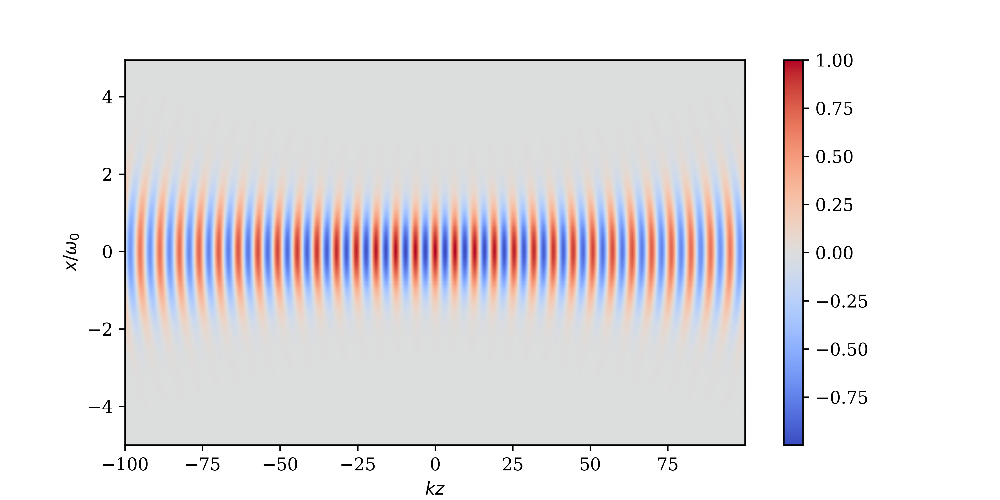

# Laser Theory {#sec-lasers}

High-intensity lasers are a key tool in the field of plasma physics. They are used to create and probe plasmas, as well as to drive high-energy particle acceleration. The interaction of laser light with plasma is complex and requires a detailed understanding of both the laser propagation and the plasma response. This chapter will introduce the theory of long-pulse laser propagation and coupling to plasma, which is essential for understanding high-energy-density physics. We start with the primary assumptions and analysis of laser propagation, before deriving the unidirectional-or paraxial-laser model. The plasma coupling mechanisms of inverse bremmsstrahlung and the ponderomotive force will then be introduced before concluding with a brief description of some of the important laser-plasma interactions that occur in the regimes of interest to this plasma regime.

## The Helmholtz Equation

Laser light is a monochromatic coherent electromagnetic wave. The starting point is Maxwell's electromagnetic wave equation.
$$
c^2 \nabla^2 \textbf{E}-c^2 \nabla (\nabla \cdot \textbf{E})=\frac{1}{\epsilon_0}\frac{\partial\textbf{j}}{\partial t}+\frac{\partial^2 \textbf{E}}{\partial t^2}.
$$

Solving this equation exactly would be numerically too demanding because the spatial and temporal resolution requirements would be too great and are unnecessary for the nanosecond pulse duration, high-power lasers used in laser-plasma physics experiments. Several simplifying assumptions can be made to reduce this equation into the paraxial laser equation. The current in a plasma is determined by the flux of the electrons. The dielectric behaviour of the plasma can thus be found from the electron equation of motion. The simplified equation of motion required for the fast electron response to the laser field is 
$$
m_e\frac{\partial (n_e \textbf{V}_e)}{\partial t}=-e n_e\textbf{E} - m_e\nu_{ei}n_e \textbf{V}_e.
$$
The high-frequency response of a plasma to the oscillating laser fields justifies dropping the pressure gradient term. The magnetic field term is ignored because unless the plasma is relativistic, it will be much smaller than the electric field contribution due to the factor $\sim v/c$. Using the definition of the current in terms of electron velocity this can be recast as
$$
\frac{\partial \textbf{j}}{\partial t}= \frac{e^2 n_e}{m_e}\textbf{E}-\nu_{ei}\textbf{j}.
$$   

Unfortunately, in order to have a closed set of equations the collision term must be rewritten in terms of the electric field. In order to do this the current in the collision term is approximated as
$$
\textbf{j}\approx-\frac{e n_e}{m_e \omega_l^2}\frac{\partial \textbf{E}}{\partial t}, 
$$  
which only holds in the regime where the collision frequency $\nu_{ei}$ is much less than the laser angular frequency $\omega_l$. Therefore the wave equation can be written
$$
c^2 \nabla^2 \textbf{E}=\frac{e^2 n_e}{\epsilon_0 m_e}\left(\textbf{E}+\frac{\nu_{ei}}{\omega_l^2}\frac{\partial \textbf{E}}{\partial t}\right)+\frac{\partial^2 \textbf{E}}{\partial t^2}.
$$

Given this describes a laser field, the electric field can be considered a product of the fast temporal oscillation at the laser angular frequency $\omega_l$ and a slowly varying 'envelope' $\textbf{E'}(\textbf{r})$, where in total $\textbf{E}(\textbf{r})=\textbf{E'}(\textbf{r})e^{-i\omega_l t}$. It is not necessary to resolve the fast oscillation of the wave because the $\omega_l$ timescale is much faster than the timescale of the plasma dynamics. It is possible to integrate out the fast motion, giving an equation for the envelope of the laser field. Time derivatives of $\textbf{E'}$ are ignored as the envelope is assumed to be slowly varying. 

It is here we make use of the paraxial approximation, whereby $\textbf{k}\cdot\textbf{E}=0$. This limits the validity of this model to small angle refraction from the wavevector axis (to within $\pm 15$ degrees). While large angle refraction does occur in plasmas, the setups within most experiments are securely within the small-angle regime. This approximation removes the $\nabla \cdot \textbf{E}$ term in the wave equation. This leaves the Helmholtz equation 
$$
\nabla^2 \textbf{E'}+\frac{\omega_l^2}{c^2}\epsilon\textbf{E'}=0.
$$
Where the dielectric function $\epsilon$ is defined as
$$
\epsilon=1-\frac{\omega_p^2}{\omega_l^2}+i\frac{\omega_p^2}{\omega_l^3}\nu_{ei},
$$
when expressed in terms of the plasma frequency,
$$
    \omega_p=\frac{e^2 n_e}{\epsilon_0 m_e}.
$$

This Helmholtz equation for the laser envelope provides a powerful and tractable model for simulating laser propagation in underdense and near-critical plasmas. The dielectric function $\epsilon$ encodes both dispersive and absorptive effects of the plasma on the laser field. The real part of $\epsilon$ governs wave refraction, with the index of refraction given by $n=Re(\epsilon)$​, while the imaginary part describes  absorption, often referred to as inverse bremsstrahlung. This absorption mechanism dominates in dense, low-temperature plasmas where electron-ion collisions are frequent. The frequency dependence of $\epsilon$ also reveals the cutoff condition: when $\omega_p=\omega_l$​, the dielectric function vanishes, and the wave is unable to propagate further. This defines the critical density surface, beyond which the laser cannot penetrate. This critical surface plays a key role in laser-plasma interactions, acting as the interface where laser energy is deposited and converted into plasma motion, heat, or magnetic field generation. Despite its simplifying assumptions, the Helmholtz model captures essential physics for laser beam propagation, refraction, and absorption in inhomogeneous plasmas and is widely used in both theoretical and numerical laser-plasma modeling.

## The Paraxial Laser Model

The paraxial laser model is a simplification of the Helmholtz equation and it is based on the assumption that the laser beam is nearly collimated, meaning that it does not diverge significantly as it propagates. This allows us to derive a simpler equation that captures the essential physics of laser propagation while ignoring higher-order effects. This is also a form of a slowly varying envelope approximation. It is possible to write the electric field of a linearly polarised wave $\textbf{E'}$ in terms of the envelope $\psi$ (the magnitude in the axis of polarisation) and the phase $\phi(z)$. Without loss of generality the direction of propagation is chosen to be along the $z$-axis which gives
$$
E'(r,z)=\psi(r,z)\exp i\phi(z). 
$$

The field is linearly polarised so it can be expressed as a complex scalar field. The phase function $\phi$ is chosen such that
$$
\phi(z)=\frac{\omega_l}{c}\sqrt{\epsilon_a} z.
$$
The factor $\epsilon_a$ is the dielectric function at the axis (that is, $r=0$). This expression is plugged into the Helmholtz equation and the envelope is assumed to be slowly varying such that
$$
|\partial_{zz}|<<|k\partial_z|.
$$
This is equivalent to assuming the wavevector of the laser light is directed along z axis and any variation away from this direction is small. This yields the paraxial transport equation
$$
2ik\sqrt{\epsilon_a}\partial_z \psi+\nabla^2_\perp \psi+k^2\left(\epsilon-\epsilon_a\right)\psi=0,
$$
where the vacuum wavenumber $k$ is
$$
k^2=\frac{\omega_l^2}{c^2}.
$$

The paraxial transport equation allows one to use the intensity $I$ of the laser field directly, calculated from the laser envelope $\psi$
$$
    I=\frac{1}{2} c \epsilon_0 \eta |\psi|^2,
$$
with the speed of light $c$, the permitivity of a vaccum $\epsilon_0$ and $\eta$ is the refractive index, defined as
$$
    \eta=\sqrt{1-\frac{\omega_p^2}{\omega_l^2}}.
$$

## Gaussian Optics

In a vacuum the paraxial equation has a cylindrically symmetric solution known as a Gaussian beam. This solution is a valuable approximation to many real-world beam profiles for the model of the laser pulse field before it enters a plasma. This solution is 
$$
\psi(r,z)=\psi_0 \frac{w_0}{w(z)}\exp\left(\frac{- r^2}{ w(z)^2}\right)\exp\left(-i k z  -\frac{i r^2}{2 R}+ i \phi (z)\right).
$$
This solution is defined in terms of the following parameters, the beam waist size
$$
w(z)=w_0\sqrt{1+\frac{z^2}{z_r^2}},
$$
the beam radius of curvature
$$
R(z)=z\left(1+\frac{z_r^2}{z^2}\right),
$$
the Rayleigh length,
$$
z_r=\frac{ k w_0^2}{2},
$$
and the Gouy phase
$$
\phi(z)=\arctan (\frac{z}{z_r}).
$$

A map of the real part of the laser envelope $\psi$ can be found in @fig-gaussbeam.

{#fig-gaussbeam}
