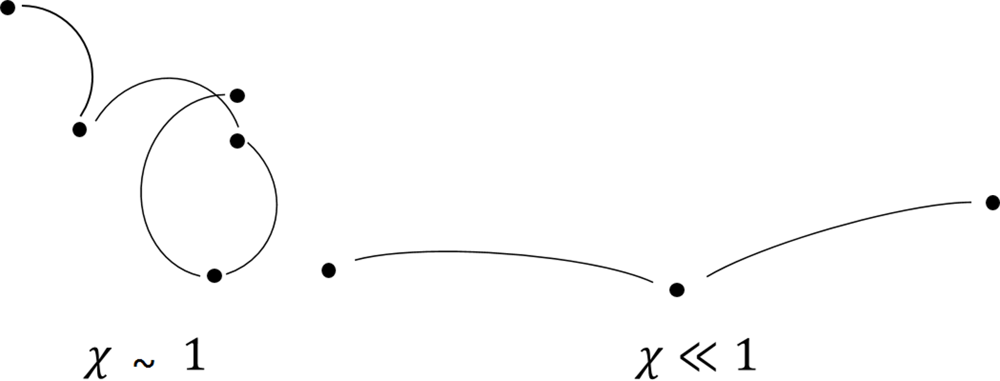

# Magnetised Transport {#sec-transport}

Now that the system is closed, the next step is to understand the form of the transport coefficients in a magnetised plasma. This section will discuss the form of these coefficients, their derivation and the different phenomena that arise from them. Understanding these coefficients is critical for accurate modelling of plasma behaviour in contexts ranging from magnetic confinement fusion and space plasmas to inertial confinement experiments and astrophysical jets.

## The Transport Coefficients

Acting under the Lorentz force, electrons in a magnetised plasma travel on circular orbits in the plain perpendicular to the direction of the magnetic field $\hat{\textbf{b}}$. These orbits have a radius $r_L(=v/\omega_c)$, the *Larmor radius* and orbit at the Larmor or *cyclotron frequency*, $\omega_c$,
$$
\omega_c=\frac{e B}{m_e}.
$$

Electrons in a plasma are constantly performing Coulomb collisions with ions and other electrons. In classical plasma theory, transport is a collisional process and it is possible to parameterise the influence of the magnetic field in terms of a dimensionless parameter known as the *Hall parameter*
$$
\chi =\omega_c\tau_{ei},
$$
which is a product of the electron-ion collision time and the electron cyclotron frequency. This parameter is a measure of how magnetised the plasma is; when electrons undergo Coulomb collisions, they hop onto a different Larmor orbit. If the Hall parameter is low, (see @fig-colpic) the magnetic field does not deflect the electron far from its path between collisions, if the Hall parameter is large the electron is effectively 'confined' to a small region, with the electron performing potentially many full orbits between collisions.  

{#fig-colpic}

The deviation from isotropic, unmagnetised transport is encapsulated in the dimensionless tensors $\underline{\underline{\boldsymbol{\alpha}}}^c,\underline{\underline{\boldsymbol{\beta}}}^c,\underline{\underline{\boldsymbol{\kappa}}}^c$, 
\begin{align*}
&\underline{\underline{\boldsymbol{\alpha}}}=\frac{m_e n_e}{\tau_{ei}}\underline{\underline{\boldsymbol{\alpha}}}^c,\\
&\underline{\underline{\boldsymbol{\beta}}}=\underline{\underline{\boldsymbol{\beta}}}^c,\\
&\underline{\underline{\boldsymbol{\kappa}}}=\frac{n_e T_e \tau_{ei}}{m_e}\underline{\underline{\boldsymbol{\kappa}}}^c.
\end{align*}
When the plasma is completely unmagnetised, such that $\chi\rightarrow 0$, the coefficients $\underline{\underline{\boldsymbol{\alpha}}}^c,\underline{\underline{\boldsymbol{\kappa}}}^c$ become diagonal and $\underline{\underline{\boldsymbol{\beta}}}^c$ vanishes. These correspond to the classical Spitzer-Härm transport coefficients. The Spitzer-Härm coefficients are isotropic and can be written in terms of the electron-ion mean free path $\lambda_{ei}$, the electron-ion collision time $\tau_{ei}$ and the electron temperature $T_e$. 

To better understand the effect the anisotropic, off-diagonal terms have on transport, these coefficients can be written in a geometry where the basis is set by the direction of the magnetic field. When a magnetic field is applied to a plasma, it defines a preferred direction, breaking the isotropy of transport processes in a plasma and turning the transport coefficients into tensors. The magnetic field direction is defined
$$
\hat{\textbf{b}}=\frac{\textbf{B}}{|\textbf{B}|}.
$$
Given this geometry it is possible to write the contraction of a general transport coefficient $\underline{\underline{\eta}}$ with a driving gradient $\textbf{s}$ as
$$
\underline{\underline{\eta}}\cdot\textbf{s}=\eta_\parallel \hat{\textbf{b}}( \hat{\textbf{b}}\cdot\textbf{s})+\eta_\perp \hat{\textbf{b}}\times (\textbf{s}\times\hat{\textbf{b}})+\eta_\wedge \hat{\textbf{b}}\times\textbf{s}.
$$
This splits the transport into three terms, parallel $\eta_\parallel$, perpendicular $\eta_\perp$ and cross-perpendicular $\eta_\wedge$ to the magnetic field. These directions are illustrated in @fig-b_geometry.

{#fig-b_geometry}

A Cartesian tensor form for this contraction will be useful when transitioning to a numerical model,  
$$
    \eta_{ij}=\eta_\parallel b_ib_j+\eta_\perp\left(\delta_{ij}-b_ib_j\right)+\eta_\wedge\epsilon_{ikj}b_k, 
$$
which in full matrix form is
$$
\underline{\underline{\eta}}=
\begin{pmatrix}
\eta_\perp+(\eta_\parallel-\eta_\perp)b^2_x && -\eta_\wedge b_z+(\eta_\parallel-\eta_\perp)b_x b_y && \eta_\wedge b_y +(\eta_\parallel-\eta_\perp)b_x b_z \\
\eta_\wedge b_z +(\eta_\parallel-\eta_\perp)b_x b_y && \eta_\perp+(\eta_\parallel-\eta_\perp)b^2_y && -\eta_\wedge b_x +(\eta_\parallel-\eta_\perp)b_y b_z \\
-\eta_\wedge b_y+(\eta_\parallel-\eta_\perp)b_x b_z && \eta_\wedge b_x +(\eta_\parallel-\eta_\perp) b_y b_z  && \eta_\perp +(\eta_\parallel-\eta_\perp) b^2_z
\end{pmatrix}
$$

The closure equations of the previous section were derived without the electron-electron collision operator. While the assumption of no electron collisions applies for high-Z plasmas, the effect must be considered for low-Z plasmas. Calculating the magnetised transport coefficients with a full electron-electron Fokker-Planck collision operator is not analytically feasible so correction factors based on numerical solutions or approximations have been developed to give expressions of the transport coefficients in terms of the dimensionless Hall parameter. These incorporate the influence of electron-electron collisions into the electron-ion collision coefficients. Further, these functional forms have explicit dependence on the Hall parameter, making them sensitive to the level of magnetisation. @fig-coefs shows one scheme of coefficients as functions of the Hall parameter for $Z=1$.

{#fig-coefs}

An important feature of these magnetised transport coefficients is their nonlinear dependence on the Hall parameter $\chi$, which reflects the transition from isotropic to highly anisotropic transport as the plasma becomes increasingly magnetised. At low $\chi$, all three coefficients $\eta_\parallel, \eta_\perp, \eta_\wedge$​ converge to their unmagnetised values, with $\eta_\wedge\rightarrow 0$ and $\eta_\perp\rightarrow\eta_\parallel$​, consistent with isotropic (Spitzer-Härm) transport. However, as $\chi$ increases, strong differences emerge: $\eta_\parallel$​ remains largely unchanged since transport along the magnetic field is unaffected by gyration while $\eta_\perp$​ drops significantly, often scaling as $∼1/\chi^2$ in the strongly magnetised limit. Meanwhile, the cross-field (Hall-like) coefficient $\eta_\wedge$​ grows and typically peaks near $\chi∼1$, where magnetic and collisional timescales are comparable, before decreasing more slowly. This leads to phenomena such as Nernst advection and Righi-Leduc heat flow, where thermal energy or magnetic flux is transported across field lines due to temperature gradients. These effects are particularly pronounced in high-energy-density plasmas, such as those encountered in inertial confinement fusion or laser–plasma interactions, where steep gradients and strong magnetic fields coexist. Understanding and quantifying this anisotropy is essential not only for accurate theoretical modelling but also for designing experiments and interpreting measurements in magnetised plasma environments.

## Magnetised Transport Phenomena

The magnetised form of the transport coefficients greatly complicates the possible behaviour with more terms and the appearance of thermoelectric transport $\underline{\underline{\boldsymbol{\beta}}}$ in Ohm's law. This section will discuss the different phenomena that appear out of these tensor coefficients.

### Diffusive and Righi-Leduc Heat Flow
With a parallel, perpendicular and cross-perpendicular decomposition, the heat flow splits into three parts
$$
    \textbf{q}_T=-\kappa_\parallel \nabla_\parallel T_e - \kappa_\perp\nabla_\perp T_e - \kappa_\wedge\textbf{b}\times\nabla T_e.
$$
The first two terms are *diffusive heat flow* and the third term is the *Righi-Leduc heat flow*. The diffusive nature is made clear by incorporating heat flow into the energy equation. If we look only at the time derivative and heat flow divergence terms, the result is a diffusion equation
$$
\frac{3}{2}n_e\frac{\partial T_e}{\partial t}=\nabla\cdot\left(\kappa_\parallel \nabla_\parallel T_e + \kappa_\perp\nabla_\perp T_e + \kappa_\wedge\textbf{b}\times\nabla T_e\right).
$$

The asymptotic forms for the perpendicular heat flow $\kappa_\perp$ as $\chi \rightarrow 0$ and $\chi \rightarrow \infty$, 
$$
\begin{align}
    \kappa_\perp &= \frac{n_e \lambda_{ei}^2}{\tau_{ei}} \frac{128}{3\pi},& \chi << 1\\
    \kappa_\perp &= \frac{n_e \lambda_{ei}^2}{\tau_{ei}} \frac{13}{4 \chi^2},& \chi >> 1\\
    &=n_e \frac{r_L^2}{\tau_{ei}}\frac{13}{4}.
\end{align}
$$
Using the length scale definition of the Hall parameter $\chi=\lambda_{ei}/r_L$, at very high magnetisation the characteristic diffusive step-length switches from the electron-ion mean free path $\lambda_{ei}$ to the Larmor radius $r_L$. The Righi-Leduc heat flow $\textbf{q}_\wedge$ acts perpendicular to both the magnetic field and the temperature gradient. It deflects the flow of thermal energy, rotating the temperature profile of the plasma in the plane perpendicular to the magnetic field. The Righi-Leduc heat flow can therefore dominate over the diffusive heat flow $\textbf{q}_\perp$ when $\chi$ is very large. In the regime of $\chi>>1$, the perpendicular thermal conductivity  $\kappa_\perp \propto \kappa_\parallel /\chi^2$ and the Righi-Leduc conductivity $\kappa_\wedge \propto \kappa_\parallel /\chi$.

### Ettingshausen Heat Flow

The Ettingshausen heat flow is a thermoelectric heat flow that results from the $\beta_\wedge$ term of the magnetised heat flow equation,
$$
\textbf{q}_E=-\beta_\wedge \frac{T_e}{e} \textbf{b}\times\textbf{j}.
$$
This flow is associated with the advection of temperature down magnetic field gradients. This is made clear when this term is substituted into energy equation and using Ampere's law to get
$$
\frac{3}{2}n_e\frac{\partial T_e}{\partial t}+\nabla \cdot\left(\textbf{v}_E T_e\right)=0.
$$
This is an advection equation for temperature with an advection velocity 
$$
\textbf{v}_E = -\frac{\beta_\wedge}{e \mu_0}\nabla B.
$$
This term has been found to play a relatively minor role in experimental platforms, with other processes dominating the thermal transport. However, it is still important to consider in simulations of magnetised plasmas, particularly in regimes where the magnetic field is strong and the temperature gradients are steep.

### The Nernst Effect

The Nernst effect likewise arises from the $\beta_\wedge$ term. However, instead it represents an advection of magnetic fields down temperature gradients. This has been used to infer a relationship with diffusive heat flow, which has been used alongside non-local thermal transport models for non-local corrections to Nernst advection. When the thermoelectric term of Ohm's law is substituted into Faraday's law, one finds an advection equation
$$
\frac{\partial \textbf{B}}{\partial t}=\nabla\times(\textbf{v}_N\times\textbf{B}),
$$
with the characteristic velocity
$$
    \textbf{v}_N=-\frac{\beta_\wedge \nabla T_e}{e B}.
$$
Therefore the Nernst effect advects magnetic fields with velocity $\textbf{v}_N$ down temperature gradients, concentrating the magnetic field in low temperature regions. The Nernst effect can play a significant role in compressing self-generated magnetic fields in high-energy-density experiements, suggesting this once-neglected effect should play a greater role in plasma physics. 

### Resistive Diffusion

In resistive MHD the term $\frac{1}{en_e}\underline{\underline{\boldsymbol{\alpha}}}\cdot\textbf{j}$, in conjunction with Faraday's and Ampere's laws can be combined to give an advection-diffusion equation
$$
\frac{\partial \textbf{B}}{\partial t}=\textbf{v}_\alpha\times(\nabla\times\textbf{B})+\frac{\alpha_\perp}{e^2 n_e^2 \mu_0}\nabla^2 \textbf{B},
$$
with the advection velocity
$$
\textbf{v}_\alpha=-\frac{1}{e^2 \mu_0}\nabla\left(\frac{\alpha_\perp}{n_e^2}\right).
$$

The second term on the right hand side refers to the resistive diffusion of the magnetic field. The advective term with velocity $\textbf{v}_\alpha$ corresponds to the resistive advection of the magnetic field in regions where the resistivity is non-uniform. While small in general, the resistive advection can grow to be as fast as the frozen in flow near shock fronts.

These magnetised transport phenomena collectively illustrate how a magnetic field not only modifies the magnitude of classical transport but also fundamentally alters its geometry and symmetry. The presence of strong magnetic fields introduces cross-field effects (like Righi-Leduc and Nernst flows) that are absent in unmagnetised plasmas, and these effects can become dominant when the Hall parameter is large. Notably, the Nernst effect provides a powerful mechanism for redistributing magnetic energy, especially in laser-driven plasmas, where steep temperature gradients naturally occur. Likewise, the interplay between anisotropic conduction and resistive diffusion creates complex magnetic dynamics not captured by ideal MHD, including magnetic field steepening and flux accretion. These transport effects are not just theoretical curiosities as they have measurable consequences on plasma structure, energy confinement, and instabilities.

## Biermann Battery Magnetic Field Generation

Though not a result of the collisional transport terms, the Biermann battery effect is an important magnetic field generation mechanism arising from the electron pressure term in Ohm's law. Though first discovered in the context of interstellar magnetic fields, the Biermann battery effect is significant in the regimes of laser-plasma interactions and has been used as a means to induce $\sim 100 T$ magnetic fields with nanosecond laser pulses.

Considering the electric field determined by the electron pressure gradient (also known as the ambipolar electric field) in Ohm's law 
$$
    \textbf{E}=-\frac{\nabla p_e}{en_e},
$$
and using the ideal gas law $p_e=n_e T_e$ with Faraday's law, the Biermann magnetic field generation mechanism follows
$$
    \frac{\partial \textbf{B}}{\partial t}=\frac{1}{e n_e} \nabla T_e\times\nabla n_e.
$$

From this expression, if the electron density and electron temperature fields have non-parallel gradients, a magnetic field will be induced via the Biermann battery effect. In laser-generated plasmas, energy deposition via a laser heating mechanism will locally heat a region of the plasma. With a very non-uniform density profile-as is common in laser-plasma interactions-magnetic field generation via this mechanism is one of the most significant sources of magnetic fields in experiments. Even if a magnetic field has not been imposed externally, this mechanism can magnetise the plasma, leading to magnetised transport terms.

