---
title: "Beyond One-Time Physics: Applications Of Extra Temporal Dimensions"
number-sections: true
date: 2025-08-15
authors:
  - name: Henry Watkins
    affiliation: University College London
    corresponding: true
    orcid: 0000-0001-6330-6195
abstract: Extra time–like dimensions offer an intriguing, if controversial, arena in which to probe long-standing puzzles such as the hierarchy problem, the cosmological-constant puzzle and the arrow of time, all of which remain unsolved within the Standard Model and general relativity. We present a coherent survey  of relativistic and quantum frameworks that extend space-time to 3+N spatial and 1+N temporal directions. After reviewing the canonical pathologies—ill-posed ultrahyperbolic dynamics, causality violation, unitarity breakdown, and tachyon/ghost instabilities—we analyse three complementary strategies for mitigating them. (1) Modified metrics and warped or re-parameterised time directions. By embedding an additional time coordinate in Randall–Sundrum-style or compact polar geometries we show how apparent instabilities can be deferred to otherwise unobservable scales, albeit at the cost of new imaginary terms in the dispersion relation. (2) Symmetry structure of the extended Lorentz group. A detailed algebraic study of SO(3,2) and SO(3,3) reveals a continuous bridge between proper and improper transformations and predicts additional conserved quantities associated with “time rotations”, highlighting fresh directions for representation theory and phenomenology. (3) Potentials generated by scalar exchange in D+N space-times. Dimensional analysis and explicit Fourier transforms demonstrate how extra temporal modes alter the r-dependence and unitarity properties of Yukawa-type potentials, placing tight bounds on any macroscopic extra time dimension. We argue that while extra-time models are heavily constrained by present laboratory, astrophysical and proton-decay limits, they remain a fertile theoretical test-bed for questions at the foundations of cosmology and quantum gravity.
bibliography: references.bib
--- 

# Introduction {#sec-intro}

In the face of unsolved problems in physics, one avenue is to consider more exotic models like extra time-like dimensions. While models with extra dimensions of space are commonplace in approaches like string theory [@polchinski2005string], comparatively less work have been accorded to the consequences of extra time dimensions. The Standard Model of particle physics has been very successful in describing the fundamental particles and interactions, but it does not explain all observed phenomena. For example, the existence of dark matter and dark energy, the hierarchy problem [@koren2020hierarchy], and the cosmological constant problem [@weinberg1989cosmological] are all issues that remain unresolved. This article will discuss the nature of time and how extra dimensions of time change particular aspects of physical processes.

Since Kaluza-Klein theory first appeared in the 1920’s with its explanation of classical electromagnetism using higher dimensional general relativity [@kaluza1926sitzungsber], extra dimensions in space-time have become commonplace in physical theories going beyond the Standard Model. The most notable being String theory and M-theory that require 10 and 11 dimensions to be consistent. These and other theories however have only considered extra dimensions of space [@perez2005introduction; @rizzo2010introduction]. While there has not been any experimental evidence for extra dimensions [@landsberg2015searches], they still remain a fruitful area of research. There has been comparatively little study into the possibility and behaviour of theories that incorporate extra time dimensions. The reason for this is that when one attempts to construct theories with extra time dimensions one is immediately presented with problems of interpretation and the violation of causality.

Time can be be thought of as simply a parameter that allows the differentiation space-like hypersurfaces upon which exists a dynamical system. It is a parameter through which physical systems appear to change. This Newtonian view of absolute time is still the standard interpretation present in quantum physics and physics formulated before Einstein and Minkowski. Space and time dimensions clearly differ in obvious ways, notably that time appears unidirectional; this arrow of time has been generally linked with the second law of thermodynamics [@Layzer]. It is possible to also control the rate of change of a space dimension coordinate without requiring a change in rest frame, but to do so in time there must be another observer and transform to their frame of reference. Cosmologically, time has a origin at the beginning of the universe, but when asked *where* the universe began the Standard Model of Cosmology says it is  *everywhere* [@dodelson2003modern]. It is hard to think of causes for these differences in nature using the best descriptions of space-time, special and general relativity, wherein mathematically the only differences appear to be the signiture of the metric and the number of dimensions.

In classical mechanics time is Newtonian absolute time. The evolution of systems is described through this parameter according to the equations of motion. In the Lagrangian formalism this is [@kibble2004classical]

$$
\frac{d}{dt}(\frac{\partial L}{\partial \dot{x_i}})=\frac{\partial L}{\partial x_i}.
$$

In his special theory of relativity, Einstein found that simultaneity required the elevation of time to the same status as the space dimensions [@einstein1905electrodynamics]. As a result it no longer followed the Newtonian absoluteness and became a changeable quantity that can dilate and change for different observers [@woodhouse2003special]. Minkowski expressed this idea geometrically in terms of the invariant interval between events in all reference frames

$$
ds^2=c^2 dt^2-dx^2-dy^2 -dz^2.
$$

The fact that in this metric space and time appear on equal terms exemplifies the connection between space and time. Furthermore, using this metric it is clear that adding extra dimensions of space or time can be done by simply modifying this metric with extra terms. This gives a window into how one can construct extra time theories. In general relativity space-time is now a dynamical field that curves depending on mass-energy distribution. The experience of time in general relativity is now the proper time that an observer's position along a world-line and is dependent on the curvature of space-time [@hawking1973large]. 

In quantum mechanics time diverges from the close relationship with space that special relativity prescribes and is treated more closely to the Newtonian time as in classical mechanics. While there is a well defined operator and uncertainty relation for space dimensions and their momentum space dual, time has no operator and the energy-time uncertainty relation is harder to derive. This is in direct opposition with special relativity where time and space are treated equivalently. The fact that time is treated so differently in general relativity and quantum mechanics is known as *the problem of time* and presents a major obstacle to understanding how a fundamental theory of physics will arise. In looking at extra dimensions it may be possible to see how time can reconciled in the two regimes [@anderson2012problem]. It is hoped that by extending space-time in some way to include extra time dimensions, perhaps compactified or included via some other mechanism, an extension of the Standard Model can be uncovered or a better understanding of the role of time within current theories found. 

Throughout this document the extra dimension of time will be given by the letter $\sigma$, and the extra energy component associated with this dimension as $\zeta$. Metrics shall have signature $diag(+---)$ i.e all time-like dimensions will be positive and space dimensions negative. In the cases of compactified dimensions the compactification size will be L; this will apply to both the compactification length of extra space dimensions and also the compactification period of extra times. Furthermore the convention of natural units will be used throughout. In this scheme the fundamental constants $G=c=\hbar=1$. This means that both time and space have dimensions of length $[t]=[x]=L$. Also from Einstein's mass-energy relation mass has units of energy $E=m$ and using the Planck energy-frequency relation energy has units of inverse length $E=1/\lambda$ since $[1/\lambda]=1/L$. Using this scheme the useful quantities of energy, mass, length and time can be given in terms of eV (electron volts) to some power.

## Ultrahyperbolic PDEs

The first effect associated with extra time dimensions in classical physics is a mathematical problem. The primary equations in physics are in the form of partial differential equations (PDEs), these may be an equation of motion that contains derivatives with respect to space and time. As such the equation of motion of a physical system will be changed when an extra dimension of time is introduced. The solutions of these equations are used to predict physical systems. Mathematically, these PDEs are in general *initial value problems* or *boundary value problems* and the condition that these yield valid solutions are that these problems are *well posed*[@courant1966methods]. Simply, this means the solution exists, is unique and the solution is continuous with the boundary conditions. One of the most important PDEs in physics and quantum field theory in particular is the wave equation. If there is more than one time dimension the equation reads

$$
\sum_{i=1}^n \frac{\partial^2 u}{\partial t_i^2}=\frac{\partial^2 u}{\partial x^2}+\frac{\partial^2 u}{\partial y^2}+\frac{\partial^2 u}{\partial z^2}
$$

In two or more $(n>1)$ time dimensions this equation was not believed to sustain a well-posed initial value problem [@tegmark1997dimensionality]. This is simply that for initial-value boundary conditions in codimension 1 (one less dimension than the full space) $u(0,t_2,x,y,z)=f(t_2,x,y,z)$, the solution is not continuous with the initial data. It is thus non-predictive since one cannot construct a well-posed initial problem for the equation. It has been shown [@weinstein2008multiple;@craig2009determinism] that when the domain of the initial data for the problem is constrained to a definite region then there exist unique, stable solutions. If the Fourier transform of the initial data is constrained so that

$$
\vert k^2\vert-\vert\omega^2\vert\geq 0
$$ 

Then it is a well posed problem. As noted by @foster2010physics a problem with this approach is that this does not extend to interacting fields and as such it is difficult to foresee how this method can be applied to real physical scenarios.

## Causality

It is axiomatic in physics that effects must follow causes and this must be so in all reference frames. If causality is violated physics faces serious conceptual problems like the Grandfather Paradox. In two time dimensions it is always possible to construct closed timeline curves and so causality can be violated [@foster2010physics]. @yndurain1991disappearance argues that in a space-time with one extra Kaluza-Klein time dimension, dispersion relations are modified by an extra term. As a result propagators would become

$$
G'(k,\zeta)=\frac{1}{k^2 +\zeta^2 -m^2 +i\epsilon}
$$

Using a compactified time dimension of size L Yndurain finds that $\zeta^2$ has the form $n^2/L^2$. In the case of extra space dimensions the denominator would be $k^2 -\zeta^2 -m^2 +i\epsilon$ and this extra term is interpreted as the Kaluza-Klein tower of excitations. Causality violation implies dispersion relations no longer hold, but since these have been verified up to very high energies in modern experiments it is unlikely that it occurs. @foster2010physics attempts to solve the problem of causality by taking the second time dimension to be *ergodic* so that the extra energy component is thermal with a very high temperature T. This means that dynamics in the second dimension are unstable and diffusive instead of ballistic.

An interesting re-interpretation from @quiros2007time that tackles this and other problems in extra time physics is the treatment of the extra term in the energy momentum relation of a compactified time theory as a correction to the energy. This means that instead of considering the $\zeta^2$ term as a correction to the mass leading to a Kaluza-Klein tower of modes, instead

$$
E^2 + n^2/L^2-p^2=m^2
$$ 

and the new energy of a particle is

$$
E'^2=E^2+n^2/L^2
$$ 

Thus there exist excited states of the same particle and no conflict with causality. Thusfar no such particle states have been observed. 

## Unitarity

In a quantum mechanical system the sum of all the probabilities of the possible states that the system can occupy must equal unity, this is simply a statement of the conservation of probability. When a compactified extra time is introduced, @yndurain1991disappearance showed there are poles at  $k^2 =-\zeta^2+ m^2 -i\epsilon$, which in the interaction of two charged particles via the electromagnetic field (such that $\alpha$ is the electromagnetic coupling constant) makes the Coulomb potential complex,

$$
V(r)= \frac{\alpha}{r}\left( 1+2\sum_n exp(-inr/L)\right) 
$$

leading to the violation of unitarity because the resulting amplitude will be complex, the interpretation of this being matter has disappeared. It has been suggested by @dvali1999constraints that Standard Model states are localised in the extra time dimension but free to occupy the other dimensions. In this approach the Kaluza -Klein modes for the standard model particles (tachyons) are absent, tachyonic gravitons however still remain. The gravitational potential that arises from the exchange of tachyonic Kaluza-Klein mode gravitons is still plagued by an imaginary part,

$$
V_n(r)=G \frac{m^2}{r} exp(-in\frac{r}{L}),
$$

leading to a tachyonic decay into nothing. When Quiros applies the same re-interpretation to the problem of unitarity the real energy is taken to be $E'$. Thus instead of finding a wave like $\psi_n\varpropto exp(\sqrt{n^2/L^2 -m^2}t)$ where $\vert\psi_n\vert^2$ can be negative or imaginary we find $\psi_n \varpropto exp(imt)\Rightarrow\vert\psi_n\vert^2\varpropto1$ as it should be. The phenomenology of this approach yields a standard propagator but the particle in question would have a tower of excited states. Returning to the thermal time dimension view of Foster. The potential in @yndurain1991disappearance is re-calculated in a thermal bath rather than a vacuum wherein $\zeta=2\pi i T$ and finds the potential is no longer complex

$$
V(r)= -\frac{\alpha}{r}\left( 1+2\sum_n exp(-Tnr)\right). 
$$

For a high temperature the corresponds to the familiar potential and this is comparable with a potential for a theory compactified with size $L=1/T$. In this way tachyonic and ghost modes are eliminated. It is suggested by @dorling1970dimensionality that an extra time dimension would make fundamental particles like the electron unstable. Since in a decay the vector sum of the energy-momentum four vectors must be equal to the energy-momentum four-vector of the original particle. In two-times we see that the rest masses of the decay products can be more than the original particle. This means particles such as electrons would not be stable against decay.

Unitary evolution of a quantum state is determined by the Schrodinger equation [@sakurai2011modern]. However, in an extra dimension of time it is not very clear if the evolution follows the same rules. Group theory and Noether's theorem imply that there would be another Hamiltonian to correspond to the section temporal evolution, and a second Schrodinger equation for this extra dimension; there would be another unitary evolution operator for evolution in this extra time. Alternitively one could construct a Schrodinger equation that includes both time derivatives

$$
H\ket{\phi} =i \hbar \dfrac{\partial \ket{\phi}}{\partial t}+i \hbar \dfrac{\partial \ket{\phi}}{\partial \sigma}
$$

Unitary evolution is very important to the path integral formulation that considers an infinite number of infinitesimal unitary evolutions along an infinite number of paths. If there exists another dimension of time, how can a state evolve while conserving unitarity in such a space-time? In the path integral formulation the amplitude is derived considering an infinite product of paths

$$
\bra{q_i}e^{-iH\delta t}\ket{q_j}
$$

which are the unitary evolutions in the time step $\delta t$ between states $q_i,q_j$ [@zee2010quantum]. In an extra dimension of time, how can we derive a path integral formulation when two unitary operators exist? The path integral formulation is based on the idea that the amplitude of a path is given by the product of the amplitudes of each infinitesimal step along the path. If there are two time dimensions, then there are two infinitesimal steps to consider, one in each time dimension.

## Tachyonic and Ghost Modes

Tachyons are states with imaginary mass and a can only move faster than the speed of light [@srivastava2025review]. With an extra time dimension comes an extra term in the energy-momentum relation. Looking again at the energy-momentum relation there is a Kaluza-Klein tower of tachyonic modes with imaginary masses quantised in units of i/L.

$$
G'(k,\zeta)=\frac{1}{k^2 +n^2/L^2 -m^2 +i\epsilon}
$$  

These tachyons severely constrict models since it would be possible for a stable particle to spontaneously decay [@dvali1999constraints;@erdem2006reconsidering]. It is possible to again use the Quiros interpretation described above. This removes the need for tachyonic modes and the problems associated with causality since tachyons move faster than the speed of light. Foster notes that modes in this kinematic regime also are seen to grow exponentially with (standard) time since an imaginary mass in $\psi\varpropto exp(imt)+exp(-imt)$ makes $\psi$ a real exponential, implying serious phenomenological problems. When another time-like term is added to the metric, we find an extra term in the denominator of the propagator for a massless vector particle that results in modes with negative norm. These are ghosts [@bandelloni1978non]. Ghosts are already present in 3+1 dimensional quantum field theories formulated in the path integral formulation, but they are normally are removed when calculating processes. In the case of higher time dimensional theories however they, as @foster2010physics points out, are not eliminated by the constraint $k_\mu A^\mu=0$. This is a serious problem as this allows the existence of particles that do not conserve probability. Their existence violates unitarity.

## Alternative Interpretations

An alternative approach formulated by Bars [@bars2006standard;@bars2010extra] is to introduce an extra space and time dimension so that space-time is 4+2 dimensional but treat the extra dimensions as ‘gauge’. A state has to satisfy a  Sp(2,R) group gauge constraint that  reduces the allowed dynamics to that of 3+1 dimensional space. Using this gauge constraint bars avoids using compactification which is the most common interpretation in the literature [@rizzo2010introduction]. The argument to this however is that if the extra dimension is removed by this constraint then it is not a true dimension but rather another arbitrary degree of freedom that may not be associated with time as we know it. @bars2010extra has in this model introduced a way to explain the strong CP problem without needing the axion [@dine2018some]. This approach has additional applications within the study of entanglement, where @pettini2025quantum uses an extra-temporal model to explore non locality in quantum mechanics.

Another use of extra time dimensions involves the cosmological constant. The cosmological constant problem arises when we find the observed value for the cosmological constant is many orders or magnitude lower than the prediction vacuum energy from quantum field theory [@weinberg1989cosmological]. It has been suggested that in a universe with an extra compactified time dimension [@aref1986extra;@quiros2007time] that the calculation of the vacuum energy would feature another term. This results in a a value for the vacuum energy density that is a function of the time dimension size and the momentum cut-off; these can be varied until the energy density predication equals that of observation, potentially providing an explanation for the cosmological constant problem.

Considering previous work, it is clear adding extra time dimensions to physics results in serious phenomenological, mathematical and conceptual problems. Models are required to maintain unitarity and causality at all energy scales, and any theory incorporating extra times must keep these two fundamental concepts. Therefore in this work I constrain extra-time models to the very small scale and high energy regions, since these are the area that lie outside the region available to current experiments.

# The Nature of Time {#sec-investigations}

Time is an intuitive quantity is used to differentiate two spatial hypersurfaces. If there were two time dimensions that an observer were capable of experiencing on the macroscopic scale then they must see two concurrent evolutions or paths of a system. If there was no different behaviour between the two dimensions then there would be no reason to use two dimensions. In particular in the case of chaotic systems it would hypothetically possible to see a single system with very similar initial state in the two times evolving to very divergent end states. This approach of considering time as parameterising the path of evolution then raises the question of why do systems evolve in one way and not another, as would be seen in two dimensions of concurrent but separate time evolution? There may be one dimension because there is only one way a system can evolve. It seems that it may be more useful to treat time as a parameter of evolution as it is in quantum mechanics rather than an extra component of space-time as Einstein tells us in relativity.

## Relative Nature of Space and Time
If one were to solve Einstein's field equations to find the metric describing the curvature of space-time in the Sun-Earth system, one would expect in normal 3+1 dimensional space-time to find the region curved in the Schwarzschild or Kerr [@woodhouse2007general] manner (this being the sun's gravitational field) and a smaller region of curvature orbiting around it (the earth's gravitational field) within the larger well. This metric would be time-dependent in the spatial part since the orbiting earth changes its position. If one were to then consider 3+2 dimensional space-time and (hypothetically) solve for the metric in this case one would assume that the spatial elements would be the same albeit with some new dependence on the new time dimension. It would be possible to create a whole range of orbits of the same spatial but temporally different profiles based on the way you change the two time dimension values. How can two separate paths of evolution as one assumes above match up with this system in which both times are part of the same manifold together to create the particular result?

The only mathematical difference in relativity between space-like and time-like dimensions are the signs in the metric and the number of each type of dimension. Is there something missing in the mathematical description of space and time that would give a more complete description of the different properties of space and time? We can list the differences between space and time:

* 3 dimensions of space, 1 dimension of time
* Space is bidirectional, time appears unidirectional
* Cosmologically, there is a well defined moment when the universe began but the scale parameter in the FLRW metric of standard cosmology implies that there is no spatial origin. There is a special point for time but not space [@melia2022friedmann].
* Subjective comprehension of time is limited one moment of time at a time but can comprehend the extent of space.

How can these differences be encoded mathematically in current theories of physics? 

One could try thinking of reasons why there is only one dimension of time: 
1. The evolution of systems as we know it cannot happen in more than one time. 
2. Some physical law restricts the number to one.
3. Life cannot exist in extra time spaces and so the only dimensionalities that are observed are one-time spaces. 
4. Following [@tegmark1997dimensionality] physics is not predictive in $>1$ time, is the link with mathematics so deep as to prevent non-predictive universes from existing?
5. Would two times lead to two evolutions? If there were two ways a system could evolve then maybe the two paths would quickly become divergent and fall away from one another thus the two times are not apparent.
6. Because there simply is no dependence on extra dimensions, if no dependence of physics on an extra dimension then it would be unobservable even if it did exist. The requirement for existence is that the is a dependence or interaction between different parts of a system.  
7. String theorists have found that their theories require extra dimensions of space to be consistent [@zwiebach2004first]. If there exists a theory of everything then it may be found to be only consistent in one dimension of time in the same way as String theories in extra space dimensions.

Expanding on #5, possibly there is one dimension because in two times there would be two kinds of evolution with different paths and end results for us to differentiate the two (if they followed the same path there would be no need to use two times). Since physical systems follow specific laws and those laws have unique solutions, then only one kind of evolution to the end state is possible. Hence even if there were 100 times we could not discern them from each other. Physical laws only act in one way and so only one beginning to end path. One evolution, one time.

Number #3 above follows @tegmark1997dimensionality and introduces an anthropic principle argument. One invokes the anthropic principle in considering dimensionality by first saying that through the Strong Anthropic Principle: The dimensionality is such that the universe can hold sentient observers [@benioff2002towards]. Or the Weak: The dimensionality is such that it is restricted by the requirement that there must exist sites where life can evolve. The dimensionality is suitable for life to evolve so observers can exist. Thus in our universe we appear to see (3+1) dimensions.

In theories with extra dimensions of space, it is conventional to apply Kaluza-Klein compactification [@kaluza1926sitzungsber] where the extra dimension is compactified onto a manifold of very small size (see @fig-compactification). In effect, one takes the extra dimension y, and curl it into a circle of radius L so that the point $y= \pi L$ is the same as $y= -\pi L$. This gives the dimension a periodic character. As a result any field variable $\phi(x)$ will satisfy: $\phi(x,y)=\phi(x,y+2\pi L)$. This allows the decomposition of a state $\phi$ [@quiros2007time],

$$
\phi(x,y)=\sum_n \phi_n (x)e^{iny/L}, n\in (0,\pm 1,\pm2,...).
$$

Then L is taken to be so small that it is out of reach of observation and at macroscopic scales space-time appears 4-dimensional. So far there has been no evidence to support extra compactified dimension models like the ADD model [@dvali1999constraints; @Gingrichlimits].

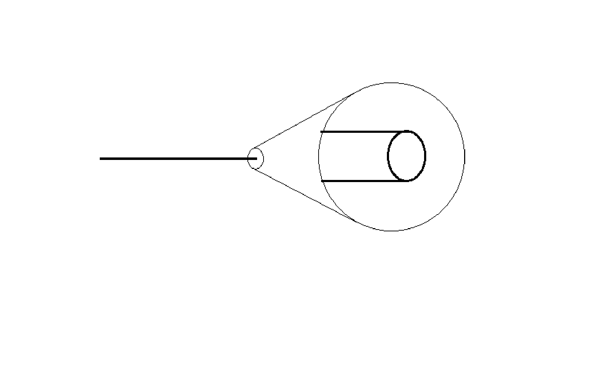{width=50% #fig-compactification}

When one uses a Kaluza-Klein compactification approach [@yndurain1991disappearance; @quiros2007time;@dvali1999constraints] as in many extra space theories, it is impossible for this extra time to be macroscopically visible. However, this introduces an added conceptual problem shared with other extra-space dimensional theories; this being what mechanism causes this compactification and why compactify a seemingly arbitrary number of the dimensions available? This method of dealing with extra dimensions has been utilised in @sec-potentialenergy to study potential energies in extra dimensions. It is found that the compactification method introduces particular side-effects on physics, this implies the method of compactification or whatever way of reducing the extra dimensions out of macroscopic view is very important in the resulting physical theory. 

It has been suggested by @dorling1970dimensionality that an extra time dimension would make fundamental particles like the electron unstable. Since in a decay the vector sum of the energy-momentum four-vectors must be equal to the energy-momentum four-vector of the original particle. In two-times we see that the rest masses of the decay products can be more than the original particle. This means particles such as electrons would not be stable against decay.

@fig-lightcone shows the light-cone in the three dimensions of x, t and the extra time $\sigma$. This shows clearly how one can create a closed time-like curve in the t-$\sigma$ plane. @fig-lightconecompact shows the reduced lightcone where the extra time is compactified. If the extra time is compactified it only allows a finite range of values and so any closed time-like curves will be contained in a small region. The argument of causality violation via closed time-like curves can be weakened by assuming the effect of the causality violation is reduced because the range of values that the extra time can take is very small and so possible non-detectable in current experiments.

::: {#fig-cones layout-ncol=2}

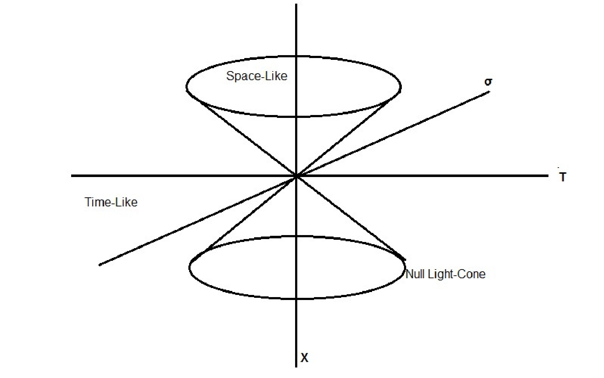{#fig-lightcone}

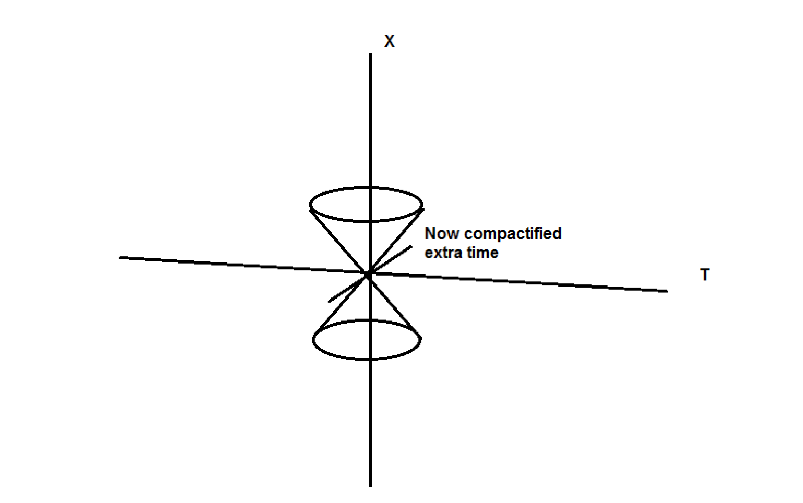{#fig-lightconecompact}

Lightcones in two-time dimensional spaces
:::

# Warped Spaces and Non-Minkowski Metrics {#sec-warped}

In this section I investigate incorporating extra dimensions of time by using a modified non-Minkowski metric. Here the extra dimension is warped or has a some property that allows it to be removed or reduced in size so that it is not observable. Warped extra dimensions follow the approach of the Randall-Sundrum model [@boos2012geometry;@rizzo2010introduction]; these models were originally introduced to explain the hierarchy problem by introducing a warped extra dimension into the metric. Furthermore, @oliveira2014gravity introduced warped extra dimensionas as a means of exploring beyond standard model physics. It is an interesting way to introduce new dimensions and here I extend it to extra dimensions of time.

The general line element describing a spacetime with metric tensor g is

$$
ds^2=g_{\mu \nu}dx^\mu dx^\nu.
$$

The Randall-Sundrum metric is 

$$
ds^2=e^{-2\kappa y} \eta_{\mu \nu} dx^\mu dx^\nu -dy^2
$$

It is simple to take the extra dimension and make it a time dimension by changing the sign. For a conformally flat metric 

$$
dy^2=e^{-\kappa y} d\sigma^2
$$

this means that our metric that we will use is

$$
ds^2=\dfrac{1}{\kappa^2 \sigma^2} (\eta_{\mu \nu} dx^\mu dx^\nu + d\sigma^2).
$$

With this metric within the Lagrangian for a massive scalar field we arrive at a wave equation of the form

$$
-m^2 \phi =\dfrac{1}{\kappa^2 \sigma^2}( \partial_x^2 \phi + \partial_y^2 \phi+\partial_z^2 \phi -\partial_t^2 \phi) -\dfrac{1}{\kappa^2 \sigma^2}\partial_\sigma^2 \phi+\dfrac{2}{\kappa^2 \sigma^3} \partial_\sigma \phi
$$

which when we apply a fourier transform of $\phi$  we find a dispersion relation like

$$
\omega^2+\zeta^2=\kappa^2 \sigma^2 m^2 +k^2 +2\dfrac{\zeta i}{\sigma}
$$

This dispersion relation has terms that are dependent on the extra dimension and it is clear that it produces effectively an increasing mass term that belies any real physicality. The imaginary term can be considered to vanish for large $\sigma$ but it fails to describe a real particle since imaginary terms in the dispersion relation to not have any conventional meaning. 

## A Reparameterised Extra Time Dimension

In this section a parameterisation of an extra dimension of time is explored whereby the extra dimension is parameterised by a polar coordinate $\theta$ with a constant radius. The intention being that the dimension is restricted to a small region but without adhering to the compactification description of other extra dimensional theories. A potential metric of this kind is 

$$
ds^2 =\eta_{\mu \nu} dx^\mu dx^\nu +L^2 d\theta^2.
$$

The values L is a constant radius or period of the extra dimension; the dimension takes the form of a polar angular dimension but with a constant radius to ensure a small size. Then the connection to the real dimension $\sigma$ is taken to be

$$
\begin{aligned}
\sigma = \tan(\theta/2) && \theta \in [ -\pi ,\pi ] \Rightarrow \sigma \in [ -\infty,\infty ]
\end{aligned}
$$

This is chosen so that $\sigma$ goes from minus infinity to plus infinity as would be expected of a dimension of space-time but is confined so that the entire range fits within a finite range of $\theta$. This particular parameterisation has been chosen as it is simple but any where $\sigma$ goes from minus infinity to infinity in a finite range of $\theta$ will suffice. This results in 

$$
ds^2 =\eta_{\mu \nu} dx^\mu dx^\nu +4L^2\left( \dfrac{1}{1+\sigma^2}\right) ^2 d\sigma^2
$$

Since this is merely a change of coordinates, there is no warped space-time and this metric still satisfies the Einstein vacuum equation. This leads to a geodesic equation.

$$
\ddot{\sigma}+\dfrac{2\sigma}{4L^2 +\sigma^2}\dot{\sigma}^2=0
$$

When looking at a light-like geodesic it is possible to derive

$$
\begin{aligned}
\dot{t}^2-\dot{x}^2-\dot{y}^2-\dot{z}^2+\dfrac{4L^2}{(1+\sigma^2)^2}\dot{\sigma}^2=0 \\
A^2-B^2-C^2-D^2+\dfrac{4L^2}{(1+\sigma^2)^2}\dot{\sigma}^2=0\\
\dot{\sigma}^2 =\dfrac{(1+\sigma^2)}{2L}\sqrt{D^2+C^2+B^2-A^2}\\
\sigma=tan\left(\dfrac{\sqrt{D^2+C^2+B^2-A^2}}{2L}\tau + C' \right).
\end{aligned}
$$

Where A,B,C,D are constants as a result of the other  coordinates being constant with respect to proper time. From these equations one can see that the path of a photon is straight in the unwarped dimensions, but in the extra dimension of time the path is determined by the size L and follow a tan curve parameterised by proper time. For L very large $\sigma$ can be considered proportional to proper time and so in the limit of infinite-sized (unconfined) $\sigma$ there is a correspondence between proper time and this extra time. To see what happens when this metric is used in the Klein-Gordon equation, consider the requirement that the action is invariant under general coordinate transformations.

$$
\dfrac{2L}{(1+\sigma^2)}\left[-m^2 \phi -\partial_\mu \partial^\mu \phi\right] =\dfrac{(1+\sigma^2)}{2L}\partial^2_\sigma  \phi +\dfrac{\sigma}{L}\partial_\sigma \phi. 
$$

Where $\mu$ goes from 0-3 and doesn't include the extra time. Using a standard wave-like $\phi=expi(Et+\zeta \sigma - k_x x-k_y y- k_z z)$. This equation leads to a dispersion relation

$$
E^2 + \dfrac{(1+\sigma^2)^2}{4L^2} \zeta^2 -2\sigma\dfrac{(1+\sigma^2)}{2L^2} i\zeta=m^2+k^2.
$$

As in the Randall-Sundrum model, this dispersion relation also includes an imaginary term. However in this case the normal terms found in a dispersion relation E, k and m are unchanged and for the limit $L\rightarrow \infty$ the conventional 3+1 dimensional dispersion relation is returned. Both the extra terms arising from the extra dimension are dependent of $\sigma$ and so are not constant. This is problematic because we expect the energy-momentum relation to be constant and frame invariant, but if the $\sigma$ increases then the other terms must change to satisfy the equality, leading to non-physical changes in the other terms in the relation. We expect the relation $E^2=m^2+k^2$ still holds in normal time. If $\sigma$ changes in t- time then the other terms must also change to satisfy the relation but the relation $E^2=m^2+k^2$ must hold regardless of changes in $\sigma$. This dispersion relation in turn leads to the propagator

$$
D(k)=\left[ E^2 + \dfrac{(1+\sigma^2)^2}{4L^2} \zeta^2 -2\sigma\dfrac{(1+\sigma^2)^2}{4L^2} i\zeta-m^2-k^2+i\epsilon \right] ^{-1}
$$ 

This propagator does not have any trivial simple poles so finding useful observables would be highly non-trivial for this case.   

## An Extra Time Dimension with a Different Speed of Light

This section explores the possibility of an extra dimension of time in which light travels at a different speed as in our standard time. Henceforth the letter $a$ will mean the speed of light in the extra dimension of time. If light travels slower in one dimension of time relative to another dimension of time, then all behaviour in the extra dimension of time will occur on a much slower time-scale. As a result, this dimension will appear to be slowed down with respect to the other time dimension. In theory the parameter $a$ can be reduced to such a small scale that in effect no time passes in the extra time dimension. Observable effects would be limited to very long-term cosmological observations. What effects would be apparent if the speed of light was smaller in the extra dimension of time? Considering the metric

$$
ds^2=c^2dt^2 +a^2 d\sigma^2 -dx^2 -dy^2 -dz^2
$$

where $a<<c$. In this case it is expected small scale motion in the extra dimension, held out of sight of previous experimental bounds is the norm. It may be possible to observe these changes in the decays of unstable particles with lifetimes of a similar order to the timescale of the occupation of this extra dimension. If a wave-like exponent solution $Ae^{ipx}$ is used as a solution to the wave equation with this extra 'slow' time then the dispersion relation is

$$
\dfrac{\omega^2}{c^2}+\dfrac{\zeta^2}{a^2}=k^2.
$$ 

The second dimension of time can be reduced to an infinitesimal, unmeasurable scale by increasing the value of $a$. So instead taking the opposite limit of large $a$ results in the correspondence with conventional, unitemporal physics. Going back to the idea of a slow time, since the limit of $c\rightarrow 0$ corresponds to increased gravitational strength, then perhaps in a slow time the force of gravity would become much stronger. In the Einstein Field equations the coupling constant between matter and geometry is $8 \pi G/c^4$ so changes to the speed of light in one or more time dimensions produces a consequential, observable signal in the strength of gravity.

# Groups and Symmetries {#sec-groups}

In an extra dimension of time there is a new degree of freedom that a particle can explore. When one introduces another dimension one also introduces extra symmetries asrising from an extra degree of freedom. One cna accordingly study the group theory of extratemporal Lorentz transformations [@tung1985group]. The Lorentz group is the group of transformations that leave the Minkowski metric invariant, and so in 3+1 dimensions it is the group of transformations that leave the Minkowski metric invariant. In 3+2 dimensions this is the group of transformations that leave the Minkowski metric invariant in 5 dimensions. Furthermore, when the new dimension is time-like Noether's theorem implies [@robinson2011symmetry] there is a brand new quantity of an extra energy and the new quantity associated with the new angle between the time dimensions. The question is how we interpret these quantities. 

The extra quantity associated with the linear translation in the new time has the units of energy. The extra quantity associated with time rotations has the units of angular momentum. How to measure the existence and value of these quantities is also an open question. The extra energy may be observable not as a conserved quantity, since the quantity would be conserved only with respect to the extra time and not the other normal time. As such under some compactified time situation the extra energy may exist as very small modifications to the energy spectrum as noted by @quiros2007time.

In this section I develop the group theory of the extra time dimension and the new quantities that arise therefrom. An initial look at adding an extra time dimension will mean the Minkowski metric becomes $\eta=diag(1,1,-1,-1,-1)$. So equations like the wave equation contain extra terms. Importantly, the dispersion/energy-momentum relation acquires another energy,

$$
E^2+\zeta^2-p^2=m^2.
$$ 

What is this extra energy and how is it manifest? In addition to this when the Euclidean group transformations are considered and invoke Noether's theorem, the conserved current (which for Euclidean group transformations is the energy-momentum tensor)

$$
T^\mu_\nu=\dfrac{\partial \mathcal{L}}{\partial(\partial_\mu \phi)} \partial_\nu \phi -\delta^\mu_\nu \mathcal{L}
$$

contains extra terms that are unlike momentum or energy. This introduces extra difficulty in interpretation. The energy momentum tensor derived from Noether's theorem in 3+2 dimensions is (where the extra dimension is denoted by $\sigma$),

$$
T^M_N=\begin{pmatrix}
\mathcal{H}_\sigma & \mathcal{P}_{\sigma,t} & \mathcal{P}_{\sigma,x} & \mathcal{P}_{\sigma,y} & \mathcal{P}_{\sigma,z} \\
\mathcal{P}_{\sigma,t} \\
\mathcal{P}_{\sigma,x} & & T^\mu_\nu \\
\mathcal{P}_{\sigma,y} \\
\mathcal{P}_{\sigma,z} 
\end{pmatrix}
$$

$T^\mu_\nu$ is the familiar energy momentum tensor. The full form has been omitted for brevity but it is a $4\times4$ tensor. The second quantity to look at is the angular momentum-like quantity that results from invariance in changes of time-angle, this provides another difficulty in interpretation. Angles between two space dimensions can be interpreted as the relative occupation of each dimension. Zero degrees meaning no occupation and 45 degrees mean 50/50 occupation of both space dimensions.If we extend this interpretation to time dimensions, we can choose the time-angle to be arbitrarily small and experimentally difficult to detect.

The conserved quantity associated with time rotations is found to be of the form $t\zeta-E\sigma$. This is from considering the representation of the rotation operator in SO(3,3) associated with time rotation and its application to some arbitrary quantum state. In the context of an electron in the H atom, the electron is spatially bound but temporally unbound and with a fixed energy for some energy level. Therefore as t increases and E is constant and $\zeta$ is assumed also constant (assuming linear translation invariance in $\sigma$ ) then for this quantity to be constant then changes in sigma are positive $\Delta\sigma>0$ and $\sigma\propto t$. The trivial interpretation is to say that $\sigma=t$ and $E=\zeta$, in which case there is no extra quantity of time rotation and no extra time.

## Structure of the Lorentz Transformations in 2T
For extra time dimensions space-time must still satisfy the definition of a Lorentz transformation [@robinson2011symmetry]

$$
 \eta_{\mu \nu} \Lambda^\mu_\rho \Lambda^\nu_\lambda =\eta_{\rho \lambda}
$$

in order to maintain the interval $-t^2-\sigma^2+x^2+y^2+z^2=-t'^2-\sigma'^2+x'^2+y'^2+z'^2$. When the two times are taken to be equivalent, so that there exists a rotation between the two times that follows SO(2), there is a boost for the extra time as well. It is difficult as to how to interpret velocity in two times and so it is more useful to use the rapidity rather than velocity in the transformation, thus another rapidity is introduced corresponding to boosts in the second time dimension. In this system, there are 2 new kinds of transformations in 2T; one new rotation parameterised by a time angle and three new boosts associated the new time dimension parameterised by the rapidity, the hyperbolic angle between the new time and the space dimension. Looking at the determinant of the definition of the Lorentz group 

$$
\begin{aligned}
det(\eta_{\mu \nu} \Lambda^\mu_\rho \Lambda^\nu_\lambda)=det(\eta_{\rho \lambda}) \\
\Rightarrow det(\eta_{\mu \nu}) det(\Lambda^\mu_\rho \Lambda^\nu_\lambda)=det(\eta_{\rho \lambda}) \\
\Rightarrow det(\Lambda)=\pm 1,
\end{aligned}
$$

the Lorentz transformations normally considered are orthochronous, i.e have $det=1$ and when $det =-1$ they are improper and do not describe physical frame transformations. If there is the extension to two times, will it allow the Lorentz transformations to bridge the gap across the proper and improper regions? Normally, in 1 time dimension

$$
\begin{aligned}
\eta_{00} = \Lambda^\mu_0 \Lambda^\nu_0 \eta_{\mu \nu} \\
\Rightarrow ( \Lambda^0_0)^2 - \sum^3_i (\Lambda^i_0)^2 =1 \\
\Rightarrow  |\Lambda^0_0| \geq 1
\end{aligned}
$$

but in two time dimensions

$$
\begin{aligned}
( \Lambda^0_0)^2 +(\Lambda^5_0)^2 -\sum^3_i (\Lambda^i_0)^2 =1 \\
\Rightarrow ( \Lambda^0_0)^2 +(\Lambda^5_0)^2 \geq 1 
\end{aligned}
$$

Where the index 5 represents the extra time $\sigma$. This means that even if $-1\leq \Lambda^0_0 \leq 1$ then the relation above can still be satisfied so there is a union of the proper (orthochronous) and improper Lorentz transformations in two or more time dimensions. This allows what would be a time reversal transformation in 3+1 dimensions to become a proper Lorentz transformation for some adequate value of $\Lambda^5_0$. Parity transformations could be merged into proper Lorentz boosts. 

## Group Theory of SO(3,2)
In order to properly study extra dimensions one must look at the group theory of the extended Lorentz group. Since the Lorentz transformation restricts the form of our equations through Lorentz invariance, it can determine much of the behaviour when making changes of frame. The SO(3,1) group has representations in 4 dimension space-time [@tung1985group]. There are two types of representation, those of boosts and those of rotations. These have the form:

Rotations:

$$
R_z(\theta_x)=\begin{pmatrix}
  1 & &   \\
   & 1 & \\
     & cos \theta_x & sin \theta_x  \\
   & -sin \theta_x & cos \theta_x
 \end{pmatrix}
$$

with similar representation for the other dimensions. 
The boosts then have the form:
Boosts:

$$
 B_x(\phi_x)=\begin{pmatrix}
  cosh \phi_x & -sinh \phi_x & & \\
  -sinh \phi_x & cosh \phi_x & & \\
  & & 1 &  \\
  & & & 1
 \end{pmatrix}
$$

The generators of the group can be found using 

$$
 J_i=-i\frac{dR_i (\theta_i)}{d \theta_i}\vert_{\theta_i =0}
$$

and in general 

$$
\begin{aligned}
R(\theta)=e^{i \theta \cdot J}\\
 B(\phi)= e^{i \phi \cdot K}
\end{aligned}
$$

The lie algebra of SO(3,1) is then 

$$
\begin{aligned}
\left[ J_i,J_j \right]=i \epsilon_{ijk} J_k \\
\left[ J_i,K_j \right]=i\epsilon_{ijk} K_k \\
\left[ K_i, K_j \right] =-i\epsilon_{ijk} J_k
\end{aligned}
$$

If one re-writes these in a new basis of $N_i^\pm =\frac{1}{2}(J_i \pm K_i)$, then one finds that the $N_i$ satisfy the lie algebra if $SU(2)\times SU(2)$ so there is an isomorphism between SO(3,1) and $SU(2)\times SU(2)$. If extra time dimensions are introduced so that there is the SO(3,3)group as the Lorentz group say, then it would be useful in terms of representation to find an isomorphism between this group and some product of smaller groups. In two times there are 4 rotations (3 space +1 time) and 6 boosts described by the representations of SO(3,2). When working from the representations one can compute generators and find the Lie algebra. If the rotation in time is given the letter Q and the extra boosts are given the letter M then the lie algebra of SO(3,2) is found to be

$$
\begin{aligned}
\left[ J_i,K_j \right]=i\epsilon_{ijk} K_k \\
\left[ J_i,J_j \right] = i \epsilon_{ijk} J_k\\
\left[ K_i,K_j \right] = -i \epsilon_{ijk} J_k \\
\left[ K_i, M_i \right] = -i Q_{\sigma t} \\
\left[ M_i,M_j \right] = -i \epsilon_{ijk} J_k \\
\left[ Q_{\sigma t} , J_i \right] =0
\end{aligned}
$$

The first commutation relation means two boosts of different time dimensions-but with the same space dimension-result in a time rotation.

## Group Theory of SO(3,3)
In a 3+3 dimensional space there are 5 types of transformations within the general Lorentz transformation SO(3,3). There are space rotations, time rotations and three types of boosts corresponding to the three time dimensions. From the general dimensional commutator one finds all the commutation relations of the SO(3,3) generators.
An arbitrary dimensional Lorentz group generator is given by @robinson2011symmetry

$$
(J^{\mu \nu})^{a b} =-i(\eta^{\mu a} \eta^{\nu b}-\eta^{\nu a} \eta^{\mu b})
$$

and the general commutation relations are

$$
\left[ J^{\mu \nu} ,J^{\rho \lambda}\right] =i(\eta^{\lambda \mu} J^{\rho \nu}-\eta^{\lambda \nu} J^{\rho \mu}-\eta^{\rho \mu} J^{\lambda \nu}+\eta^{\rho \nu} J^{\lambda \mu}).
$$

Where the indices are the two dimensions that the transformations works between. They have values 0,1,2,3,4,5 where 4 and 5 are the extra time dimensions. The commutation relations between the five generators of the five types of transformation can thus be found (using the letters $\sigma$ and $\rho$ to signify the new time dimensions). In the generators the letters J shall represent generators of space rotations, Q for time rotations, K will be associated with boosts in the t- direction, M with boosts in the $\sigma$-direction and N for $\rho$ boosts. One finds

$$
\begin{aligned}
\left[J_i,J_j\right] &=i \epsilon_{ijk}J_k\\
\left[Q_i,Q_j\right] &=i \epsilon_{ijk}Q_k\\
\left[K_i,K_j\right] &=-i \epsilon_{ijk}K_k\\
\left[M_i,M_j\right] &=-i \epsilon_{ijk}M_k\\
\left[N_i,N_j\right] &=-i \epsilon_{ijk}N_k\\
\left[J_i,Q_j\right] &=0\\
\left[J_i,K_j\right] &=i \epsilon_{ijk}K_k\\
\left[J_i,M_j\right] &=i \epsilon_{ijk}M_k\\
\left[J_i,N_j\right] &=i \epsilon_{ijk}N_k\\
\left[Q_t,K_j\right] &=0 \\
\left[Q_\sigma,M_j\right] &=0 \\
\left[Q_\rho,N_j\right] &=0 \\
\left[Q^{ij},K^{in}\right] &=i K^{jn}\\
\left[K^{ij},M^{mn}\right] &=
\begin{cases}
  -i Q^{im}, & \text{if } j=n \\
  0,  \text{if } j\neq n
\end{cases}
\end{aligned}
$$

One can see that two boosts can produce a time rotation. When trying to find the irreducible representations of SO(3,1), one can reintroduce the generators in such a way that make the isomorphism of SO(3,1) with $SU(2)\times SU(2)$ more apparent and use the irreducible representations of SU(2). For SO(3,3) one recombines the generators of SO(3,3) in a similar way to find the irreducible representations. We create raising and lowering operators out of the generators of SO(3,3). I follow the approach in @tinkham2003group to extract SO(3,1) raising operators out of the boost and rotation generators:

$$
A_i^\pm=\dfrac{1}{2}(J_i\pm K_i)
$$

which satisfies the Lie algebra of $SU(2)\times SU(2)$. We would like to follow the same approach and so one introduces 12 new operators (6 raising 6 lowering) for SO(3,3) as follows:

$$
\begin{aligned}
A_i^\pm=\dfrac{1}{2}(J_i\pm K_i)\\
B_i^\pm=\dfrac{1}{2}(J_i\pm M_i)\\
C_i^\pm=\dfrac{1}{2}(J_i\pm N_i)\\
D_i^\pm=\dfrac{1}{2}(Q_i\pm K_i)\\
E_i^\pm=\dfrac{1}{2}(Q_i\pm M_i)\\
F_i^\pm=\dfrac{1}{2}(Q_i\pm N_i)
\end{aligned}
$$

It is expected these operators to follow $SU(2)\times SU(2)$ but it may not necessarily be the case because of the commutation relations between time rotation generators may introduce new behaviour. After making these changes of basis it is clear that A, B, and C satisfy a $SU(2)\times SU(2)$ Lie algebra but D,E and F satisfy a different Lie algebra

$$
\left[D^+_i,D^+_j\right] =\frac{i}{4}\epsilon_{ijk}(Q_k +J_k) \;
\left[D^+_i,D^-_j\right] =0 \;
\left[D^-_i,D^-_j\right] =-\frac{i}{4}\epsilon_{ijk}(Q_k +J_k) \;
$$

and similar for E and F.

# Potentials in Extratemporal Dimensions {#sec-potentialenergy}
This section is concerned with finding the potentials that arise from scalar fields in extra dimensional space-times. The aim is to study the effect of extra dimensions of both space and time on the form of the interaction potential. Using the methods of the previous chapter the general extra dimensional potential are derived and the particular forms of certain cases discussed. Although this section will focus on scalar fields, the effects of extra dimensions will be similar to higher-spin fields since the spin of the exchange particle does not effect the r-dependence of the potential. Though this is a toy model, it allows insight into how extra dimensions can affect physics.

In quantum field theory, potentials arise from the interaction between two particles exchanging a virtual particle [@zee2010quantum]. The result of the particle exchange is the repulsion or attraction that is observed when two particle are close to one another. As illustrated in @fig-virtual where an incoming electron exchanges a virtual photon with another electron. They repel one another as they move in each other's potential well that arises from these propagating photons.

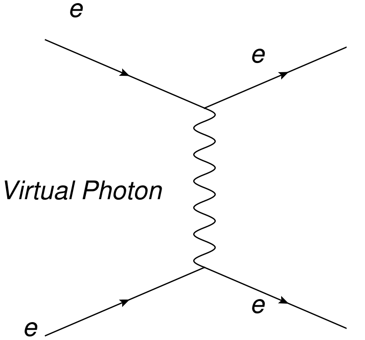{width=50% #fig-virtual}

This section begins with the case of the Yukawa potential and its derivation 3+1 space dimensions. Then I extend the analysis to an arbitrary number D dimensions. The following section looks into the effect of momentum cutoffs as a way of modifying the effect of extra dimensions. Finally extra time cases are considered and particular examples discussed.

## 3+1 Space-Time
The standard Yukawa potential is derived for a non-interacting massive scalar field theory [@yukawa1935interaction;@yukawa1950quantum] in 3 space and one time dimension. In the standard quantum field theoretical approach, it is derived from the spatial Fourier transform of the propagator [@zee2010quantum]. The propagator used will be $\tilde{D(k)}=\dfrac{1}{k^2+m^2}$; this is the general propagator for a massive scalar field with mass $m$. The Fourier transform is calculated in spherical coordinates with $k^2=k^2_x+k_y^2+k_z^2$, the spatial momenta magnitude in polar coordinates and the volume element is $k^2 dkd\theta \sin\theta d\phi$. The integral is thus

$$
\begin{aligned}
V(r)&=\int \dfrac{d^3 k}{(2\pi)^3} \dfrac{e^{ik\cdot r}}{k^2+m^2}\\
&=\int_0^{2\pi} d\phi \int_0^{\pi} \sin\theta d\theta \int_0^\infty \dfrac{k^2 dk}{(2\pi)^3}\dfrac{ e^{ikr\cos\theta}}{k^2+m^2}
\end{aligned}
$$

Using $u=\cos\theta$, such that $du=-\sin\theta d\theta$

$$
\begin{aligned}
V(r)&=\int_{-1}^1 du \int_0^\infty \dfrac{k^2 dk}{(2\pi)^2}\dfrac{ e^{ikru}}{k^2+m^2}\\
&=\dfrac{2i}{(2\pi)^2 i r} \int_0^\infty \dfrac{k dk}{k^2+m^2}\left[e^{ikr}-e^{-ikr} \right] 
\end{aligned}
$$

and the exponential definition of Sine

$$
V(r)=\dfrac{2}{(2\pi)^2  r} \int_0^\infty \dfrac{k dk}{k^2+m^2} \sin kr
$$

Sine can be replaced since it is not symmetric across $k=0$ so it becomes $e^{ikr}$ with the limits changed to plus and minus infinity.

$$
V(r)=\dfrac{1}{(2\pi)^2 i r} \int_{-\infty}^\infty \dfrac{k dk}{k^2+m^2} e^{ikr}
$$

This integral can be evaluated using the residue theorem to yield

$$
\dfrac{1}{4\pi r}e^{-mr}.
$$

Where the upper pole im has been used. In the massless case $m=0$ the familiar $1/r$ form that occurs in Newton's and Coulomb's laws is found. The potential is shown in @fig-yukawa where the familiar decaying shape for a repulsive potential is evident.

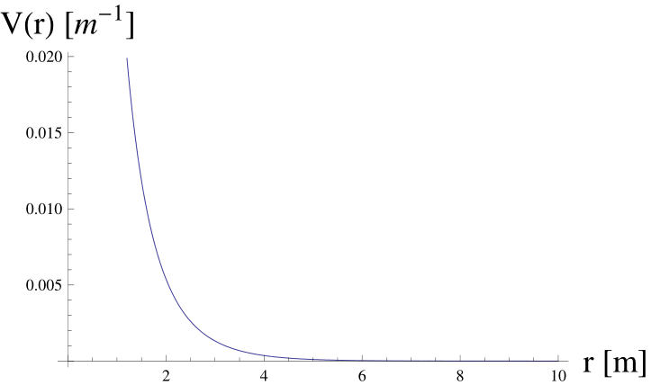{width=50% #fig-yukawa}

## Units of the Potential
Closer inspection of the way potentials are calculated reveals a problem that arises in the units of the potential in higher dimensions. The units for the potential in higher dimensions are $1/L^{D-2}$ (where D is the number of space dimensions) when a true potential should have the units of energy ($1/L$). In the ADD model [@arkani1999phenomenology] factors with dimensions of length appear in the form of multiples of the size of the compactified dimensions. This is because the fundamental Planck scale is determined by the number of dimensions through

$$
M_{Pl}^2=8\pi L^n M_D^{2+n}
$$

where n is the number of extra dimensions and L is the extra dimension size and $M_{Pl}$ is the Planck scale in 4d space-time. In the potentials derived below, there are no constants that scale in this way, but @dvali1999constraints shows that in an extra time in the framework of gravity the right dimensionality is maintained thanks to this scaling. However the question now is does there exist an equivalent law for other forces, since if extra dimensions other force laws would be affected and would also need to find a similar relation so that the units of the potential are correct. One possibility is the inclusion of some dimensionful energy cutoff scale $\Lambda$ appearing in the potential which makes the overall units correct. The solution to this unit problem may come from considering the dimensionality of the Lagrangian. The action must be dimensionless in natural units, and from the definition of the Lagrangian density in some arbitrary number of dimensions it is

$$
S=\int d^{N+D} x \mathcal{L}
$$

where N is the number of time dimensions and D is the number of space dimensions. The Lagrangian density has units of $[\mathcal{L}]=E^{N+D}$.This is energy to the power of the number of dimensions. In order to find a potential with the right units with a cutoff scale, we can study a toy scalar field model. In this model the scalar field $\phi$ of mass $m_1$ interacts with some fermionic field $\psi$ of mass $m_2$ where the Lagrangian density is

$$
\mathcal{L}= -\frac{1}{2}\phi(\partial^2+m_1^2)\phi +\overline{\psi}(i\gamma^\mu\partial_\mu-m_2)\psi+g'\phi\overline{\psi}\psi
$$

where the interaction term has some coupling constant $g'$. The interaction between these fields is illustrated in @fig-toy

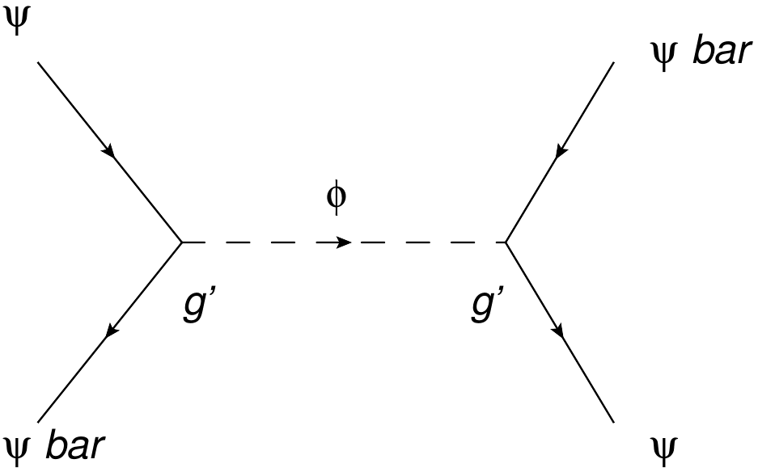{width=50% #fig-toy}

Since the Lagrangian density must be of units $E^{N+D}$, the fields in the Lagrangian density must have units $[\phi]=E^{(N+D-2)/2}$ and $[\psi]=E^{(N+D-1)/2}$. This is implied from he first two terms in the Lagrangian density. This means the coupling constant in the interaction term must have units $[g']=E^{2-\frac{N+D}{2}}$. In the familiar case of $N=1$ and $M=3$ the coupling constant is dimensionless. When a cutoff energy scale $\Lambda$ is added to the coupling constant that satisfies 

$$
g'=\frac{g}{\Lambda^{(N+D)/2-2}}
$$ 

(where g is the 4-dimensional space coupling constant), it allows the potential associated with the interaction of the fermionic field $\psi$ via the scalar field to be of the form

$$
V(r)=\frac{g^2}{\Lambda^{(N+D)-4}}\int d^D k \frac{e^{i\vec{k}.\vec{x}}}{k^2+m^2}.
$$ 

The units of this potential now satisfy $[V]=E^{2-N}$. So for N=2 time dimensions the potential has units of energy for $\forall D$. However, this allows the number of time dimensions N to alter the units of the potential. It is possible to avoid this problem by considering compactified time dimensions that do not introduce an integration over the corresponding momenta k, and so does not alter the units of the overall potential.

## D+1 Space-Time Dimensions {#sec-dplus1}
In this section the focus shall be on large extra dimensions of space and the effect on the potential for a massive scalar field. I begin with the Fourier transform of the propagator that is familiar to the Yukawa case above, but instead with D space dimensions in the integral. 

$$
V(r)=\int \dfrac{d^D k}{(2\pi)^D} \dfrac{e^{ik\cdot r}}{k^2+m^2}
$$

The volume element in D space dimensions requires definition. In D space dimensions the volume element of the hypersphere is

$$
d^D k=k^{D-1}\sin^{D-2}\phi_{D-1} \sin^{D-3}\phi_{D-2} ...\sin\phi_2 dk d\phi_{D-1} ....d\phi_1.
$$ 

Since this is an integral in momentum space, k is the radial coordinate. As there are D-1 angles in D dimensional space these are defined as $ \phi_n$ for the nth angle.

$$
V(r)=\int \dfrac{1}{(2\pi)^D} \dfrac{e^{ik\cdot r}}{k^2+m^2} k^{D-1}\sin^{D-2}\phi_{D-1} \sin^{D-3}\phi_{D-2} ...\sin\phi_2 dk d\phi_{D-1} ....d\phi_1
$$

It is now possible to represent the integrals over the angles $\phi_n$ for $2\leq n \leq D-1$ as a product just to simplify the notation.

$$
V(r)=\dfrac{1}{(2\pi)^D}\int_0^\infty \dfrac{k^{D-1} dk}{k^2+m^2} \int_0^{2\pi}\sin^{D-2}\phi_1d\phi_1 \prod_{n=1}^{D-2} \int_0^\pi \sin^{D-(n+1)}\phi_{D-n}d\phi_{D-n} e^{ikr\cos \phi_{D-1}}
$$

Now use the same substitution as above but instead with the angle $\phi_{D-1}$, since this angle is the angle with the highest power of sine in the volume element.

$$
\begin{aligned}
u &=cos\phi_{D-1},\\
du &=-\sin\phi_{D-1} d\phi_{D-1},\\
V(r)&=\dfrac{1}{(2\pi)^D}\int_0^\infty \dfrac{k^{D-1} dk}{k^2+m^2} \int_0^{2\pi}\sin^{D-2}\phi_1 d\phi_1\\ &\prod_{n=2}^{D-2} \int_0^\pi \sin^{D-(n+1)}\phi_{D-n}d\phi_{D-n} \int_{-1}^1 \frac{\sin^{D-2} \phi_{D-1}}{\sin \phi_{D-1}} e^{ikr\cos u}du
\end{aligned}
$$

It is now possible to replace the sine with $(1-u^2)$ in the integral

$$
V(r)=\dfrac{1}{(2\pi)^{D-1}}\int_0^\infty \dfrac{k^{D-1} dk}{k^2+m^2} \prod_{n=2}^{D-2} \int_0^\pi \sin^{D-(n+1)}\phi_{D-n}d\phi_{D-n} \int_{-1}^1 (1-u^2)^{(D-3)/2} e^{ikr\cos u}du
$$

Now finally the integral with the product when calculated yields a product of fractions with Gamma functions.

$$
\prod_{n=2}^{D-2} \int_0^\pi \sin^{D-(n+1)}\phi_{D-n}d\phi_{D-n}= \sqrt{\pi}^{D-3} \prod_{n=2}^{D-2} \frac{\Gamma((D-n)/2)}{\Gamma((D-n+1)/2)}
$$

When this result is input into the total calculation this gives the general result

$$
V(r)=\frac{1}{2^{D-1}\sqrt{\pi}^{D+1}}\prod_{n=2}^{D-2} \frac{\Gamma((D-n)/2)}{\Gamma((D-n+1)/2)}\int_0^\infty \dfrac{k^{D-1} dk}{k^2+m^2}\int_{-1}^1 (1-u^2)^{(D-3)/2} e^{ikr\cos u}du.
$$

In the case of even dimension spaces then the $u$ integral is found to be a Bessel function of the first kind. Therefore if the number of space dimensions D is even, then the potential takes the form:

$$
V(r)=\frac{\sqrt{\pi}^{D-3}}{2^{D-1}}\prod_{n=2}^{D-2} \frac{\Gamma((D-n)/2)}{\Gamma((D-n+1)/2)}\int_0^\infty \dfrac{k^{D-1} dk}{k^2+m^2} \frac{\pi}{(kr)^{(D-2)/2}} J_{(D-2)/2}(kr) C_D
$$

where $C_D$ is a constant found in the integration over $u$ and is dependent on the dimension $D$. The first few values are $C_2=1,C_4=1,C_6=3,C_8=15,C_{10}=105$. In the case of odd $D$ the integration over $u$ is always a hypergeometric function, the particular form of which is defined by a series expansion.

We can also derive the D-space dimensional potential for a massless scalar field in the following simpler way. Again the potential is derived from the Fourier transform of a propagator, but this time the massless scalar propagator is $1/k^2$.

$$
V(r)=\int \dfrac{d^D k}{(2\pi)^D} \dfrac{e^{ik\cdot r}}{k^2}
$$

Making the substitution for the $1/k^2$ that allows it to be represented as an exponent using a dummy variable $\lambda$

$$
\begin{aligned}
\frac{1}{k^2}&=\int_0^\infty e^{-\lambda k^2} d\lambda
\\
V(r)&=\int \dfrac{d^D k}{(2\pi)^D}\int_0^\infty e^{-\lambda k^2+ik\cdot r} d\lambda.
\end{aligned}
$$

This then allows the calculation to contain a Gaussian integral

$$
\begin{aligned}
V(r)&=\int_0^\infty d\lambda e^{-\frac{r^2}{4 \lambda}}\int \dfrac{d^D k}{(2\pi)^D} e^{-\lambda (k-\frac{ir}{2\lambda})^2}\\
&=\dfrac{1}{(4\pi)^{D/2}}\int_0^\infty d\lambda \lambda^{-D/2} e^{-\frac{r^2}{4 \lambda} }
\end{aligned}
$$

Then use the integral definition of the Gamma function 

$$
\begin{aligned}
\alpha &=\frac{r^2}{4 \lambda}\\
d\alpha &= \frac{-r^2}{4 \lambda^2}d\lambda\\
\Rightarrow V(r)&=\dfrac{1}{(4\pi)^{D/2}} \int_\infty^0 d\alpha (-\frac{r^2}{4\alpha^2})(\frac{r^2}{4\alpha^2})^{-D/2} e^{-\alpha}\\
&=\dfrac{1}{4(\pi)^{D/2}} \frac{1}{r^{D-2}}\int_0^\infty d\alpha \alpha^{D/2-1} e^{-\alpha}\\
&=\frac{\Gamma(D/2-1)}{4(\pi)^{D/2}}\frac{1}{r^{D-2}}
\end{aligned}
$$

In the massive scalar field case the replacement $k^2 \rightarrow k^2 +m^2$ is made and the result below follows from the same calculation

$$
V(r)=\frac{1}{(2\pi)^{D/2}} \left(\frac{m}{r}\right)^{D/2-1} \int_0^\infty d\alpha e^{-mr\cosh \alpha} \cosh(D/2-1)\alpha
$$

The integral over $\alpha$ is just the integral definition of the modified Bessel function of the second kind ($K$).

$$
V(r)=\frac{1}{(2\pi)^{D/2}}\left(\frac{m}{r}\right)^{D/2-1} K_{D/2-1}(mr)  
$$

This is the general D space dimension massive scalar field potential. This general potential is in the form of a modified Bessel function of the second kind, and this is illustrated in @fig-bessel. The potential falls away faster for higher dimensional cases.

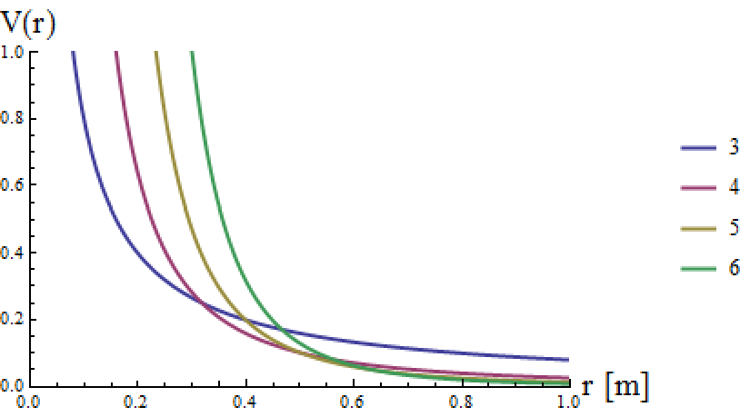{width=50% #fig-bessel}

## 4+1 Space-Time with Momentum Cutoff

We can extend our analysis to include a momentum cutoff in the potential. This is a common technique in quantum field theory to avoid divergences in integrals over momenta [@peskin2018introduction]. The cutoff $\Lambda$ is the maximum momentum that can be considered in the integral. For 4 space dimensions with a massless scalar field, where the momentum has an upper limit cutoff $\Lambda$. I begin with the Fourier transform of the propagator in 4 space dimensions

$$
V(r)=\int \dfrac{d^4 k}{(2\pi)^4} \dfrac{e^{ik\cdot r}}{k^2}.
$$

We proceed as above with the 4 space dimensional volume element

$$
V(r)= \dfrac{1}{(2\pi)^4} \int_0^\pi \sin\phi_2 d\phi_2 \int_0^{2\pi} d\phi_3 \int_0^\Lambda \dfrac{k^3 dk}{k^2} \int_0^\phi d\phi_1 \sin^2 \phi_1 e^{ikr\cos\phi_1}
$$

using the same volume element substitution

$$
V(r)= \dfrac{2}{(2\pi)^3}\int_0^\Lambda kdk \int_{-1}^1 du \sin \phi_1 e^{ikru}.
$$

This now leads to an integral definition of a Bessel function of the first kind.

$$
V(r)=\dfrac{2}{(2\pi)^3}\int_0^\Lambda kdk \int_{-1}^1 du \sqrt{1-u^2} e^{ikru}
$$

Using the integral definition to replace the integral involving $u$ yields 

$$
\begin{aligned}
V(r)&=\dfrac{2}{(2\pi)^3}\int_0^\Lambda kdk \dfrac{\pi J_1(kr)}{kr}\\
&=\dfrac{1}{(2\pi)^2 r}\int_0^\Lambda dk J_1(kr)
\end{aligned}
$$

Finally the integral over k is calculated up to the chosen momentum cutoff $\Lambda$. This takes into account that the integral of a Bessel function of the first kind equals the lower-indexed Bessel function.

$$
V(r)=\dfrac{1}{(2\pi)^2 r^2}\left[ 1-J_0(\Lambda r)\right]\rightarrow \dfrac{1}{(2\pi)^2 r^2}\; \text{for} \; \Lambda\rightarrow\infty
$$

This gives the expected dependence on r in the limit of $\Lambda\rightarrow \infty$ and this can be generalised to $D$ dimensions by using the derivation of the general potential and including a momentum cutoff. For finite momentum cutoff the potential has a second term that suppresses the infinite-Lambda solution and introduces a wavy modification to the potential. This is shown in @fig-cutoff. The Bessel function contribution also leads to a finite potential at $r=0$. The wavy behaviour becomes more pronounced for high values of $\Lambda$ and can eventually lead to small potential wells at several points along the potential curve.

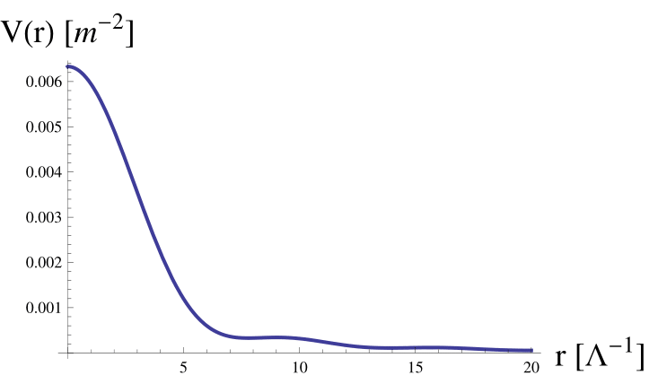{width=50% #fig-cutoff}

## D+2 Space-Time 
With the general D+1 space dimensional potential derived, it is now possible to extend the analysis to D+2 space dimensions. In what follows it is assumed that one of the time-like dimensions is compactified as described in @sec-investigations whilst the other time dimension is not. This means the propagator has an extra compactified term $-\frac{n^2}{L^2}$ in the denominator. This is the primary difference in the extra time case. The calculation in D space dimensions follows the same form as the D+1 case of @sec-dplus1. In the compactified time case for a massless field it is possible to make the substitution $m\rightarrow in/L$ into the general D-space expression and sum over all $n$ Kaluza-Klein modes.

$$
V(r)=\frac{1}{(2\pi)^{D/2}}\sum_n \left(\frac{in}{Lr}\right)^{D/2-1} K_{D/2-1}(inr/L) 
$$ 

The explicit sum is non-trivial but the potential is always complex for $\forall D$. In certain special cases the sum is evaluated and found to be finite, but the general case for arbitrary D there is no closed form. If the the field is massive then we replace $m\rightarrow Q=\sqrt{m^2-n^2 /L^2}$ and again sum over the $n$ Kaluza-Klein modes. Thus the potential for one extra compactified time and $D$ space dimensions will be

$$
V(r)=\frac{1}{(2\pi)^{D/2}}\sum_n \left(\frac{Q}{r}\right)^{D/2-1} K_{D/2-1}(Qr) 
$$ 

A few observations can be made of this potential. Firstly, in the case where $m^2 < n^2 /L^2 $ the potential is complex for all D. The form of $Q$ also makes the new time dimension component look like a contribution to the mass of the particle. For both the massive and massless cases the potential is possibly complex and introduces unitarity violation. Furthermore, one may expand this result to an arbitrary number of compactified time dimensions; however, if $s$ extra compactified time dimensions are introduced then then the dispersion relation acquires $s$ extra terms

$$
\sum_i^s \frac{n_i^2}{L_i^2}.
$$

If every extra time dimension has the same compactification size $L$, then the result is a sum over the mode indices and replaced by an overall constant 

$$
\frac{n^2}{L^2}=\frac{1}{L^2}\sum_i^s n_i^2.
$$

## Special Cases
The general potential derived in the previous section is now considered in the context of special cases. The aim is to explore how the potential behaves in different space-time dimensions and with different compactification conditions. In particular the 3+2 massless potential is

$$
V(r)=\frac{1}{4\pi r}\sum_n^\infty e^{-inr/L}
$$

This is a geometric series which can be summed to yield

$$
\begin{aligned}
V(r)&=\dfrac{1}{4\pi r} \sum_n (e^{-ir/L})^n\\
&=\dfrac{1}{8\pi r}\left[ 1-i\frac{\sin r/L}{1-\cos r/L} \right]
\end{aligned}
$$

This potential is complex-valued and its real and imaginary parts are plotted in @fig-4dt. From this figure several questions come to mind. The real part of the potential shows the decaying  profile that is expected from a potential but the imaginary part has a very  odd Tan-like behaviour with asymptotes at the values of the compactified circumference (the dimension has size L and so circumference $2\pi L$).  

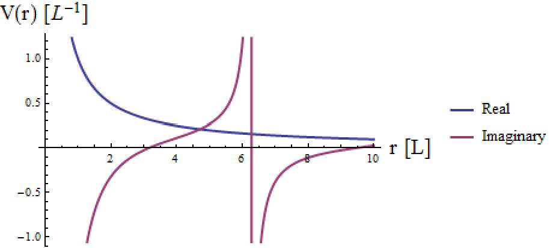{width=50% #fig-4dt}

The sum over the Kaluza-Klein modes in the massless potential for even-number space dimensions cannot be done for $D>2$ but odd-D spaces provide convergent results. For a 5+2 space time the potential is

$$
V(r)=\frac{-e^{-ir/L} L((-1+e^{ir/L})L+ir)(i/(Lr))^{5/2}}{8(-1+e^{ir/L})^2 \pi^2 \sqrt{ir/L}}
$$

This potential is plotted in @fig-5dt and again the real part acts as expected, but again there are asymptotes at the values $2 \pi nL$ in the imaginary part. In the  potentials for massive fields, the sum over the Kaluza-Klein modes cannot be performed and so it is difficult to find a closed form with which to represent the potential.

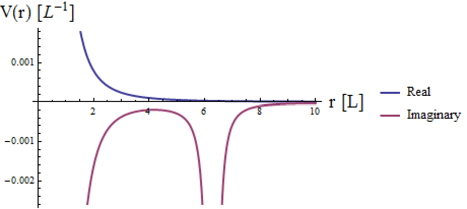{width=50% #fig-5dt}

The relative contributions of compactified space and compactified time dimensions is an additional factor to explore and warrants a particular example. The potential for one extra compactified time (3+2 space) for a massless field is derived from to be

$$
V(r)=\frac{1}{4\pi r}e^{-inr/L}
$$

However for a compactified space dimension the result is

$$
V(r)=\frac{1}{4\pi r}e^{-nr/L}
$$

which is real but still retains the tower of modes. The most important point in this comparison and others above is that the $r$-dependence is determined only by the number of un-compactified space dimensions that are integrated over in the calculation. Extra compactified dimensions introduce exponential factors that in the case of extra times are complex and in extra spaces are real. In summary, the effect of the extra times on the potential is to introduce complex-valued terms and a sum over the Kaluza-Klein tachyonic modes of the of the mediating particle. This means as-yet unobserved new behaviour is present within the potential for this toy model scalar field. It is expected that even though this was a toy model scalar field, since the spin of the particle does not effect the r-dependence and the mass of the particle can be removed, the effect does apply to other, more realistic fields and potentials.

# Phenomenological Consequences {#sec-phenomenology}

The phenomenological consequences of the potentials derived in this chapter are now considered. The aim is to explore how these potentials can be used to constrain extra time theories and what experimental observables can be derived from them. The potentials derived above are a starting point for understanding the effects of extra dimensions on particle interactions and can be used to make predictions about the behaviour of particles in these theories. These phenomenological consequences can be used to gauge the validity of the theory. The major source of experimental observables in this work is the effect on the potentials in extra dimensions. The potentials derived above and those already covered in the literature can be used to constrain extra time models either directly through force law measurements or indirectly through decay processes and bound-system processes.

There are also other sources of constraints arising from the symmetry properties described in @sec-groups and from causality violation described in @sec-intro. Scalar fields have been the toy model throughout this work; however, the spin of the field has no effect on the r-scaling and so the consequences of extra time dimensions remain valid when comparing field theories with experimental observations. The following section will look in depth at possible constraints and the current experimental bounds that exist thereon.

## Unitarity Violation
Unitarity violation is one of the primary problems associated with extra time theories. The violation of the conservation of probability must be accounted for in any viable theory; however, this course of research has not been able to find a way of introducing extra time dimensions without introducing unitarity violation. This effect then, although physically discomforting for the consistency of quantum mechanics is thus a good measure of the existence of extra dimensions of time. Extra time dimensions and unitarity violation has been explored by @erdem2006reconsidering and @yndurain1991disappearance, where the consequences of the potential could be seen in proton scattering in the nucleus and the decay of protons. This corresponds to unitarity violation since there are no non-tachyonic particles the proton can decay into. The decay is interpreted as a decay into nothing, leading to the disappearance of matter.

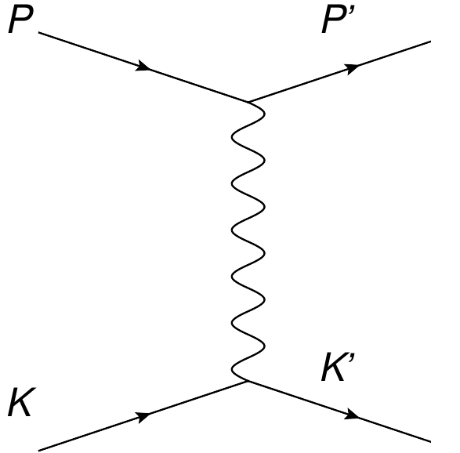{width=50% #fig-scatter}

In @yndurain2007theory the approach taken was to consider the scattering of two protons in a nucleus (see @fig-scatter). Then finding the decay width of the proton into nothing via tachyonic modes by finding

$$
\Gamma=-Im\bra{\psi}V(r)\ket{\psi}
$$ 

which can be interpreted as the rate at which probability leaks out of the system. The wavefunction of the nuclear protons is

$$
\psi=\frac{\sqrt{m_\pi^3}}{\sqrt{\pi}}e^{-m_\pi r}.
$$

This wavefunction is a bound state, and the decay is the change from the nuclear proton via the electromagnetic potential with tachyonic modes in which it sits to the proton state. Fermi's Golden Rule is used to calculate transition rates, and it is proportional to $\mid \bra{\psi_f}H'\ket{\psi_i}\mid ^2$ [@sakurai2011modern]. The fact that the potential is complex gives this imaginary part, leading to decay into nothing and hence unitarity violation. If particles disappear then probability conservation is violated. 

We can repeat the calculation with a photonic potential (such that the $\alpha$ is the fine-structure constant) in an extra time dimension by summing over the Kaluza-Klein modes [@yndurain1991disappearance]. This yields the potential

$$
V(r)=\frac{\alpha}{r}\left[ 1+2\sum_{m=1}^\infty \exp{-inr/L} \right] 
$$

and the decay width becomes

$$
\Gamma= -8\alpha m_\pi^3 \text{Im}\int_0^\infty r \left[exp(-2m_\pi r)+2\sum_{n=1}^\infty exp(-2m_\pi +in/L )\right] dr
$$

The integral is done in spherical polar coordinates; since the potential and wavefunctions are dependent on r only the integral over solid angle simply gives $4\pi$. Integrating over r gives

$$
\Gamma=-8\alpha m_\pi^3 \text{Im} \left[\frac{1}{4m_\pi^2}+2\sum_{n=1}^\infty\frac{1}{(2m_\pi+in/L)^2}\right].
$$

Only the imaginary part matters so the first term is dropped and re-arranging the second part gives

$$
\begin{aligned}
\Gamma&=32 \alpha m_\pi^4 \sum_{n=1}^\infty \frac{n/L}{(4m_\pi^2+n^2/L^2)^2}
\notag\\
&=32 \alpha m_\pi^4L^3 \sum_{n=1}^\infty \frac{n}{(4m_\pi^2 L^2+n^2)^2}.
\end{aligned}
$$

If the assumption is made that $4m_\pi^2 L^2<<1$ (this is valid in this case of small compactified dimensions) then the sum can be simplified to

$$
\Gamma=32 \alpha (m_\pi L)^3 m_\pi \sum_{n=1}^\infty \frac{1}{n^3}.
$$

Finally using the definition of the Riemann Zeta function yields 

$$
\Gamma=32 \alpha (m_\pi L)^3 m_\pi \zeta(3).
$$

Current experimental bounds on the lifetime of proton puts the lower limit at $\tau=5.9\times 10^{33}$ yrs [@abe2014search]. Yndurain's prediction for proton decay above has a lifetime of $\tau=(G_N^{1/2}/L)^3 \times 4\times 10^{29}$ yrs where L is the size of the dimension and G is Newtons constant [@yndurain1991disappearance]. This gives limit on L to be no more than $0.0407 G^{1/2}_N$. We can also extend this analysis to other potentials. In particular, considering the potential for a photon in an extra large space dimension

$$
V(r)=\frac{\alpha}{\pi r^2}.
$$

So calculating $\Gamma$ with the same wavefunctions as above yields

$$
\begin{aligned}
\Gamma&=\bra{\psi}V(r)\ket{\psi}\\
&=\int_0^\infty dr \frac{4 \alpha m^3_\pi}{\pi} e^{-2m_\pi r}\\
&=- 4m_\pi/\pi
\end{aligned}
$$

This is real-valued, but $\Gamma$ takes only the imaginary part so is no decay. For a compactified space dimension the potential is

$$
V(r)=\frac{\alpha}{r}\sum_n^\infty e^{-nr/L}
$$

and this gives the calculation (using a geometric series sum)

$$
\begin{aligned}
\Gamma&=\bra{\psi}V(r)\ket{\psi}\\
&=4\alpha m^3_\pi \int_0^\infty rdr e^{-2m_\pi r} \frac{e^{r/L}}{e^{r/L}-1}
\end{aligned}
$$

Which when utilising the integral definition of the Generalised or Hurwitz Zeta function, one arrives at

$$
\Gamma=4\alpha m^3_\pi L^2 \zeta(2,2Lm_\pi).
$$

In both these cases it is clear there is no imaginary part of the decay width as was found in the extra-time case. Overall, no decay of protons have been observed [@abe2014search] nor have any other particles like nuclear neutrons [@dvali1999constraints] or the disappearance of matter in other situations. There have also been no sightings or evidence for tachyons that arise in extra time theories [@recami2009superluminal;@skalsey2000viable]. The constraint thus on the unitarity violating nature of extra time theories is thus very strong.

## Gravity Law Modification

A second source of phenomenological consequences of extra time theories is the modification of the gravitational potential. The modification of the gravitational potential in extra dimensions can be used to constrain the size and number of extra dimensions, including time dimensions. Since the potential can be measured directly then the form of the force laws can also provide a good probe to test extra time dimensions. The potential will be affected by the dimensionality regardless of the force it is mediating. In particular the gravitational potential has been studied in depth to test for extra dimensions of space. The potential for n-extra KK space dimensions for $r>>L$ 

$$
V(r)=G_N \dfrac{m_1 m_2}{r} \sum_{k_1,k_2,k_n} e^{-2 \pi k r/L}
$$ 

and for $r<<L$

$$
V(r)=G_{N(4+n)} \dfrac{m_1 m_2}{r^{n+1}} 
$$ 

and experiments have put bounds on the fundamental Planck scale for different numbers of space dimensions[@Gingrichlimits]. If there exists one extra space dimension it is limited to a size of less than $L\leq 44 \mu m$ and if there are two then the limit is the size $L\leq 30\mu m$. Thus so far there is no evidence for the divergence of the gravity law from the familiar $1/r$ of Newton. Following the result of the ADD model [@arkani1999phenomenology] wherein Newton's gravity law is modified by the existence of extra space dimensions, @dvali1999constraints explores the time-like case and its effect on the r dependence. The potential for gravity in one extra KK time calculated by Dvali [@dvali1999constraints] is

$$
V(r)=G_N \dfrac{m_1 m_2}{r} \sum_n e^{-inr/L}
$$

Since this potential is complex there is also the question of how to measure the imaginary as well as the real part. It may be interpreted that the imaginary part can be discarded as unphysical, in which case limiting the extra-time behaviour will surmount to putting a limit on L so that the gravity law bounds mentioned above still hold. However if the imaginary term is not ignored then the contribution to the energy could be observable.

# Conclusions {#sec-conclusions}

In this work we have explored methods of incorporating extra dimensions of time into physical theories and the consequences that arise both theoretically and phenomenologically. Although this work has only covered a limited range of the possible avenues into the nature of extra time dimensional space-times, it is already clear that considerable barriers are encountered not just in conceptual interpretation but also in the way we calculate observable quantities.

In @sec-intro several major problems associated with extra times were isolated and throughout this project several more were found. In particular the phenomena of causality and unitarity violation were isolated as two significant problems associated with two time theories. It seems that it is not possible to include extra times without also relinquishing unitarity and causality in quantum mechanics. This does however provide a good measure of discovering extra dimensions of time.

The conceptual basis of an extra dimension of time was explored and the relationship time has with physics discussed. In particular the fact that space-time has only one dimension of time and its relative nature to space was investigated and a list of apparent ideas proposed as to the cause of the dimensionality of space-time. Also discussed was what evolution means in extratemporal theories. Since time and the evolution of physical systems are so finely connected, adding an extra time changes the meaning of time as an evolution parameter.

@sec-warped investigated extra dimensions by modifying the metric. The possibility of using this method to introduce extra times was found to be promising but can produce complicated mathematical forms if the metric is not carefully chosen. The primary example of this approach consisted of introducing a scale factor to produce an alternative method of compacting a dimension. This approach in the future may prove fruitful in adding extra dimensions.

@sec-groups explored the group and symmetry properties of physics in extratemporal space-times. The Lorentz group and its Lie algebra were studied for both two and three times. The Lie  algebra was found to contain new connections between the generators, this encodes the new behaviour of the extra times. For example, it is made clear that different time boosts lead to a rotation in the time plane. There is likely more behaviour that is unstudied in this extended Lorentz group, in particular the representations of the group and how they are connected to different kinds of particle behaviour warrants further study. Furthermore, it is argued that the extra symmetries that exist in extra times correspond to extra conserved quantities via Noether's theorem. The form that these quantities is found to be unlike current energy or angular momentum and the problems these quantities face to be realistic is discussed. These quantities could be measurable and act as an experimental signal for extra dimensions.

The focus of @sec-potentialenergy was on massive scalar fields in the path integral formulation of QFT. It was found that the best way to explore the effect of extra times was to consider the potentials that arise from particle propagation. These potentials derivable from the theory contain information about the dimensionality of the space they inhabit and also have real measurable consequences. As such the potentials have yielded notable insights into the world of extra time dimensions. The most interesting points have been the form of the potentials, their complexity and how the mass and the sum over Kaluza-Klein modes give the final potential.

The tests of extra-time models of this kind focused on unitarity violation and particle decay, and the form of the gravitational force law. In the analysis it was found there are severe phenomenological constraints on the size of the extra dimension coming from experiments on the gravitational force law and on the lifetime of proton decay. The extra quantities that have been described may exist but as yet there is no evidence for extra dimensions, space or time [@aad2012search;@chatrchyan2012search].

In conclusion, theories that involve extra dimensions of time are challenging to construct and are limited by phenomenological constraints. However, they provide a valuable testbed for investigating the nature of the Lorentz group and for exploring other major problems in physics such as the Problem of Time [@anderson2012problem] and the The Arrow of Time [@Layzer]. As such they may not be useful for extending the Standard Model but are nonetheless useful in the study of the foundations of physics.

